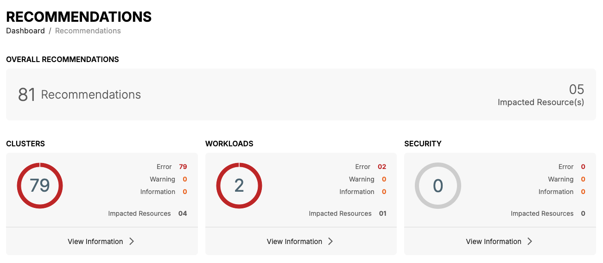
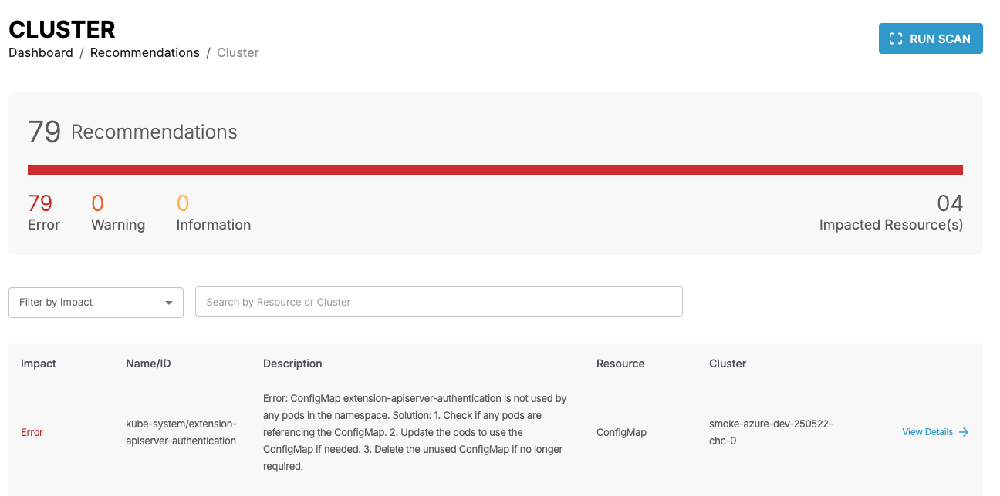
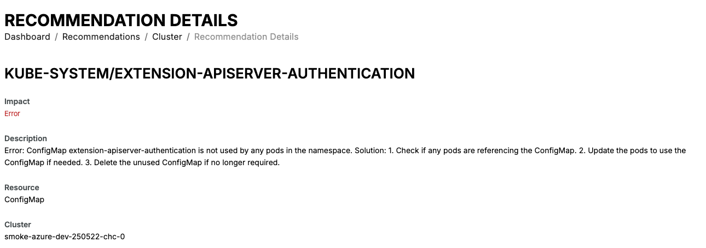
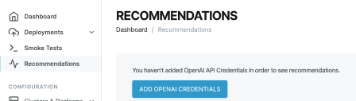

# AI Recommendations

CAEPE simplifies Kubernetes management for DevOps engineers through its intelligent Recommendation Engine. This powerful tool scans your Kubernetes clusters comprehensively, diagnosing and triaging issues clearly and concisely. Leveraging embedded Site Reliability Engineering (SRE) expertise, the Recommendation Engine transforms complex logs and signals into actionable recommendations, easily understandable in plain English. 

Users receive essential recommendations related to their Kubernetes environment, categorized into two key areas: Cluster, and Workload recommendations. All recommendations are readily accessible on the Recommendations page, with an additional dedicated tab allowing users to conveniently view and filter recommendations.

This guide shows you how to view and manage AI recommendations from wihin CAEPE application. You can access the configuration section from the _Recommendations_ menu item.

## Viewing Recommendations

You can see the overall recommendations and the individual breakdown recommendations for each category.

Click the _View Information_ link below each of the category to see more details about the AI recommendations including the impact, name/ID, dedscription, resource, cluster. 

You can also filter recommendations by error, warning or information based on the resource or cluster type

Click the _View Details_ for detail information and recommended actions to resolve the issue

## Setting up AI Recommendations

Setup the AI Recommendations by clicking the _Recommendations button.

Click _ADD OPENAI CREDENTIALS_, then enter your a unique credential name & API key in the form.

!!! info

    Find out more about [credentials](configuration/credentials.md#add-credentials).

After adding the credentials, the Recommendation Engine automatically initiates a scan. To trigger a manual scan, go to each section (cluster/workloads/security), and click _Run Scan_

!!! note

    Recommendations currently work only with an OpenAI API key. Support for other providers will be added in the future.

