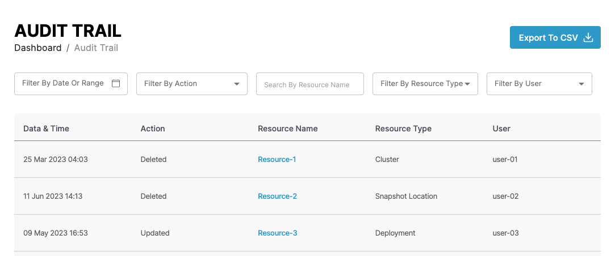

# Audit Trail

The Audit Trail enables you to track and review all events(created, updated, deleted) by users.

This guide shows you how to view Audit Trail details. You can access the configuration section from the _CAEPE Management_ > _Audit Trail_ menu item.

## Viewing Audit Trail

<!-- TODO: Nothing in the App or Figma, so making assumptions -->

You can see the audit logs in the center of the page.

You can filter by date, action,  resource name and type, and user.
