# Managing users

This guide shows you how to view, invite, create users, and configure user access & permissions to CAEPE resources. You can access the configuration section from the _CAEPE Application_ -> _Manage Users_ menu item.

## User types

CAEPE supports the following user types:

- **Users** represent an individual person who can access CAEPE and have a collection of resource access permissions.
- **Groups** represent a collection of users that can access CAEPE. Groups have access tags that grant access permissions to resources.
- **Service accounts** represent a service that can access CAEPE, such as a CI or CD tool. They have a collection of resource access permissions.
- **Access tags** grant access permissions to resources.

## Viewing users

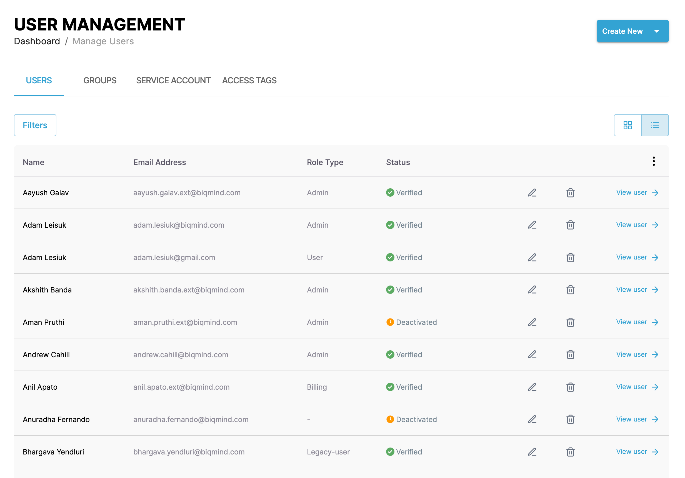

You can switch the view of the users between a "list" and "grid" view and filter the users by clicking the _Filters_ button. You can filter by name, status, and role type.

You can see the users associated with your account in the center of the page, divided into the four user types.

### Users list

Each entry in the list or grid shows the user name, email address, role type and status. Click the _pencil_ icon to edit the user or the _wastebasket_ icon to delete it.

### Groups list

Each entry in the list or grid shows the group name and number of users in the group. Click the _pencil_ icon to edit the group or the _wastebasket_ icon to delete it.

### Service account list

Each entry in the list or grid shows the user name, email address, role type and status. Click the _pencil_ icon to edit the user or the _wastebasket_ icon to delete it.

### Access tags list

Each entry in the list or grid shows the user name. Click the _pencil_ icon to edit the user or the _wastebasket_ icon to delete it.

### User details

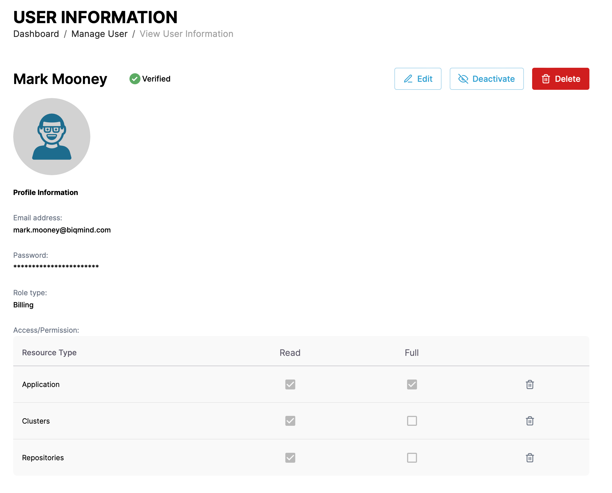

Click the _View Details_ link next to any user type to see more details about the user including the user name, email address, role type and status. You can edit, delete, and deactivate the user from the details page. When you edit a user, you can change specific resource access and permissions for the user.

## Create a user

### Individual user

Create an individual user by clicking the _Create New_ button and selecting the _User_ menu item.

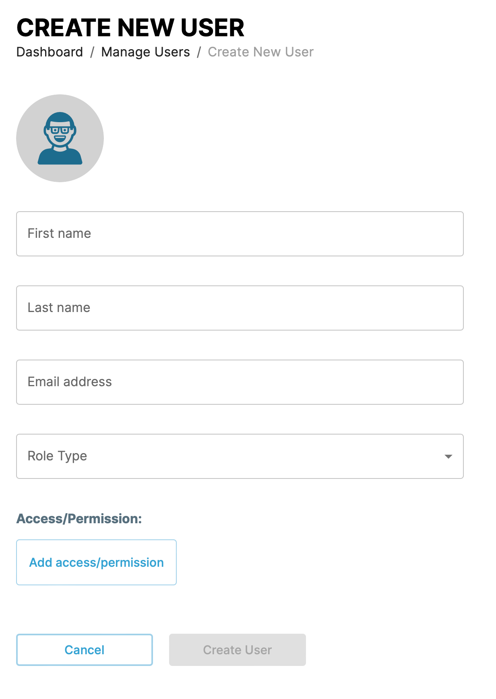

Give the user a name and email address. Select the role type for the user. The role type sets a default set of access permissions [detailed in the role types table](#role-types).

You can change the default access permissions by clicking the _Add access/permission_ button and selecting the resource type and permission combination.

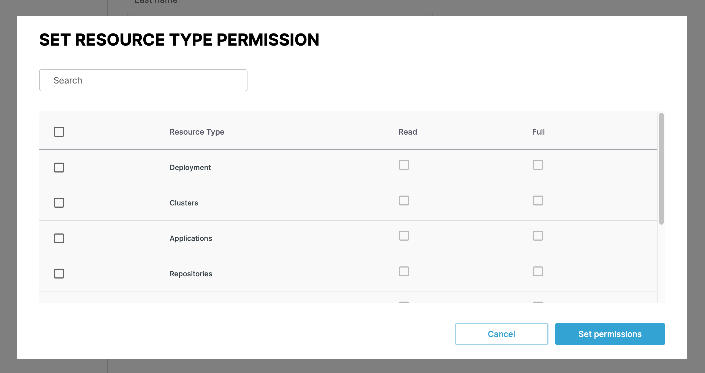

### Group

Create an group user by clicking the _Create New_ button and selecting the _Group_ menu item.

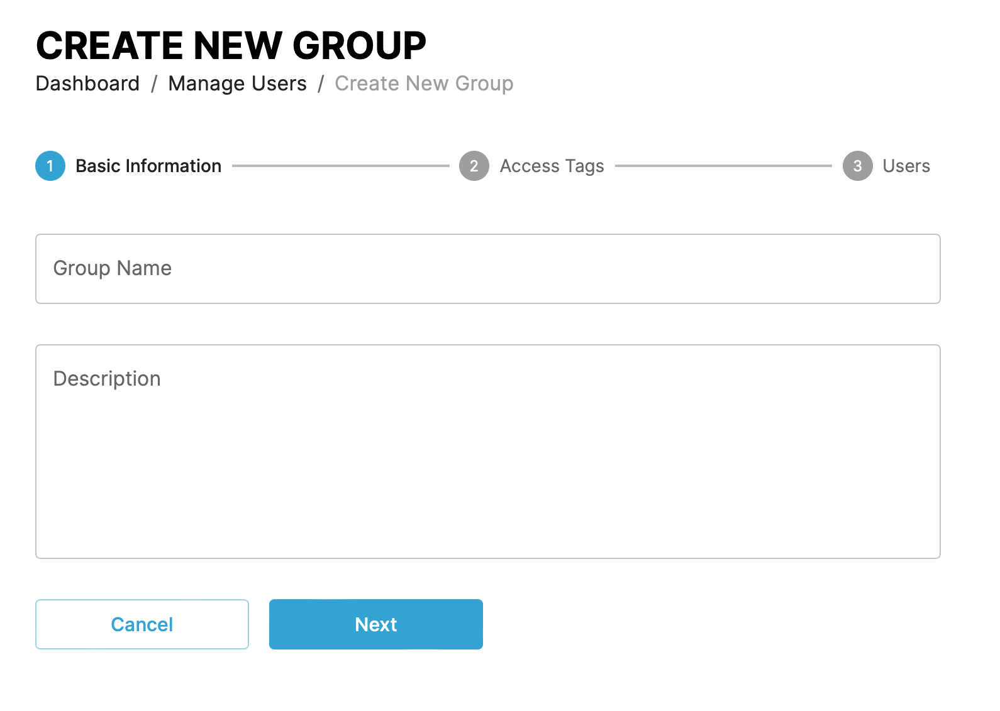

In the first step give the group a name and description. In the next steps add the [access tags](#access-tag) that grant access permissions to resources and the users that are part of the group.

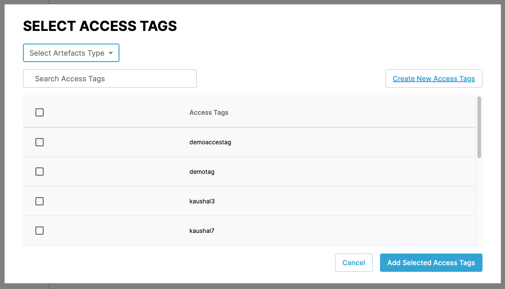

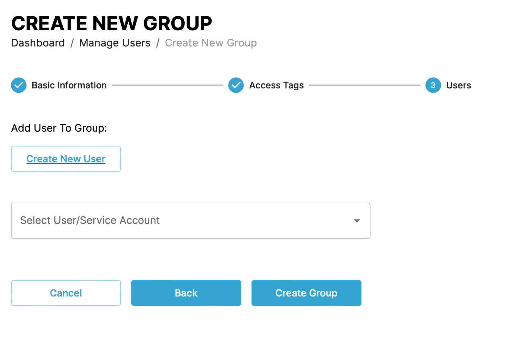

### Service account

Create an group user by clicking the _Create New_ button and selecting the _Service account_ menu item.

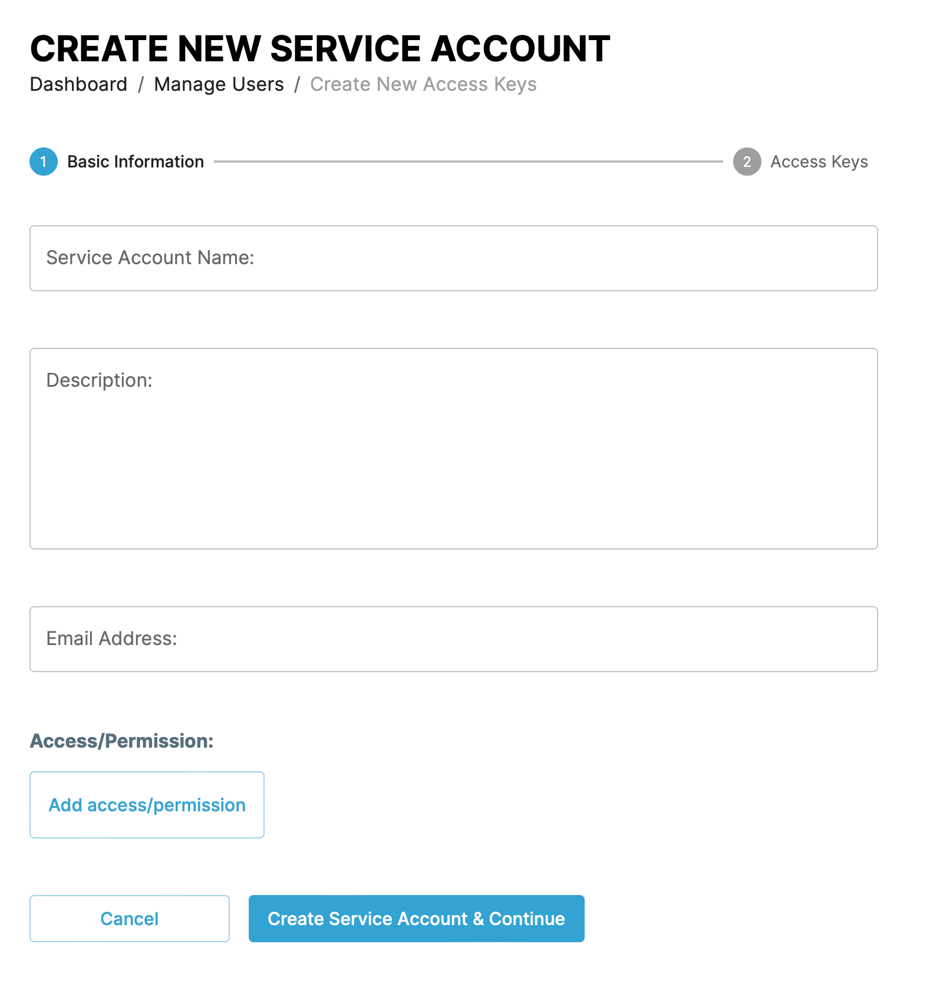

Give the service account a name, description, and email address. You can change the default access permissions by clicking the _Add access/permission_ button and selecting the resource type and permission combination.

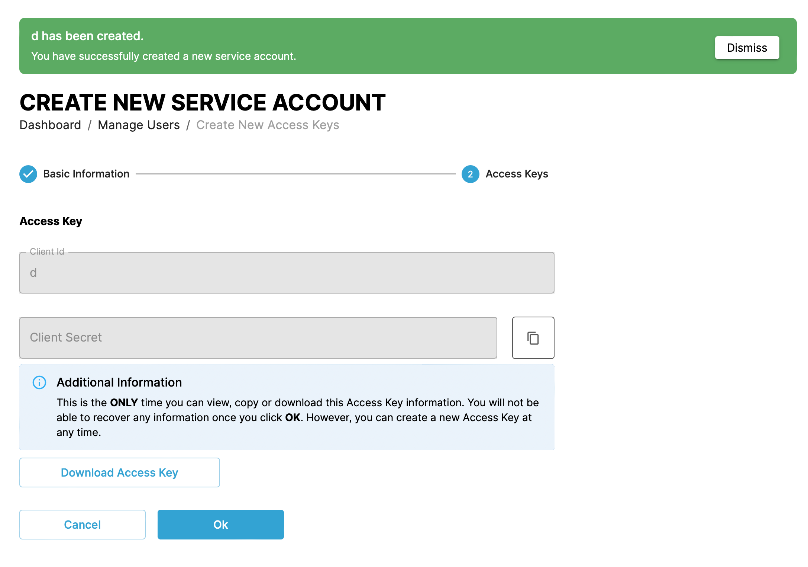

After you create a service account user, copy or download the access key. You can't access the access key again.

### Access tag

Create an group user by clicking the _Create New_ button and selecting the _Access tag_ menu item.
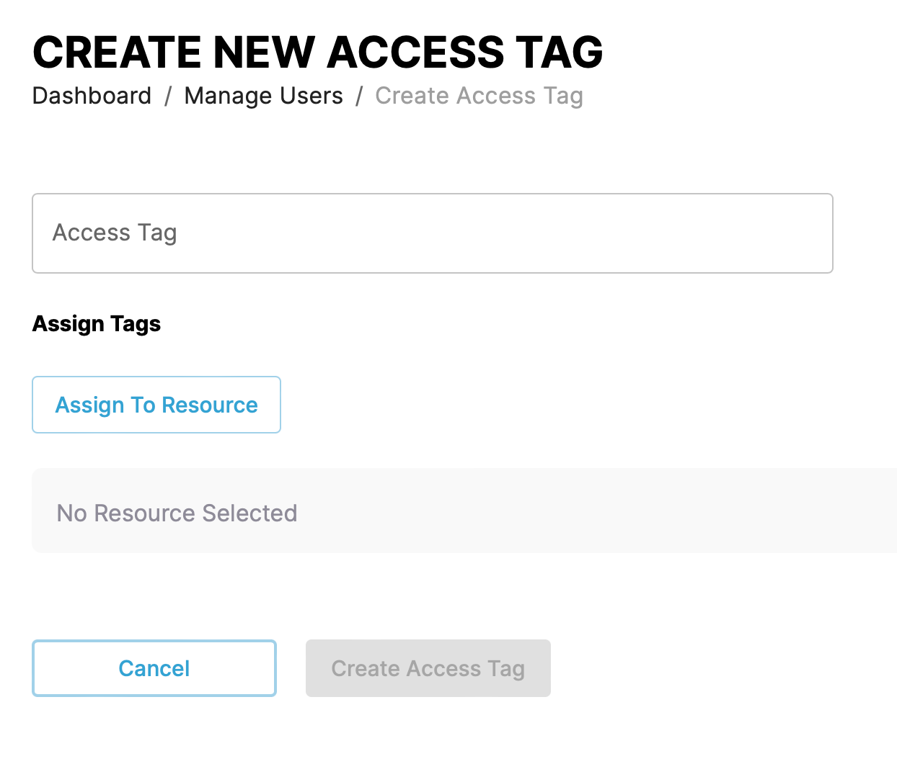

Give the tag a name, description, and select the resource access by clicking the _Assign To Resource_ button.
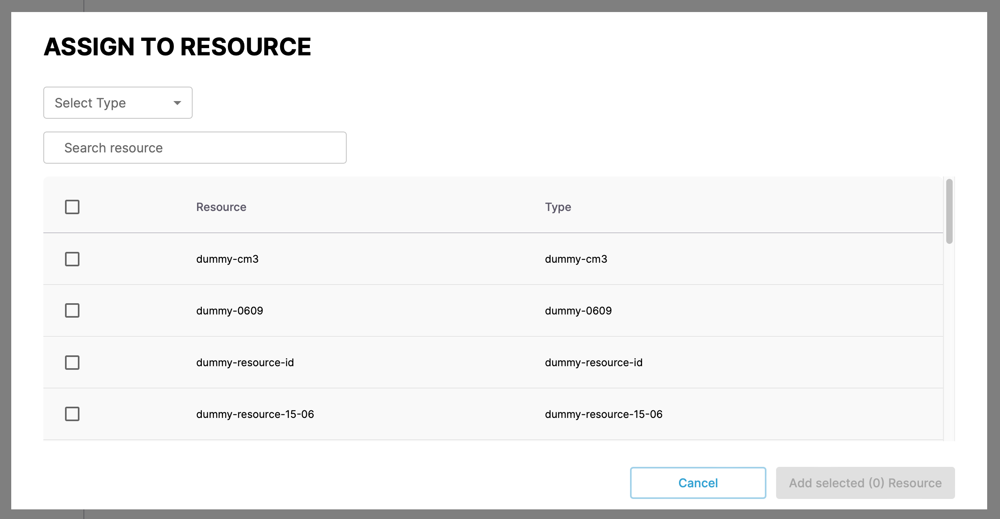

## Role types

| Role            | Purpose                                                                                                                                             | Actions                                                                                                                                                            |
| --------------- | --------------------------------------------------------------------------------------------------------------------------------------------------- | ------------------------------------------------------------------------------------------------------------------------------------------------------------------ |
| Administrator   | Admin access over the whole account, can add users, manage account & subscription, access all clusters, applications, repositories and credentials. | Manage Account Manage Subscription Manage Users Manage Clusters Manage Applications Manage Deployments Manage Repos Manage Credentials |
| Billing         | The ability to review and update subscription                                                                                                       | Manage Subscription                                                                                                                                                |
| Deployment User | Can manage CAPE App features depending on clusters assigned to them                                                                                 | Manage Clusters Manage Applications Manage Deployments Manage Repos Manage Creds                                                                   |