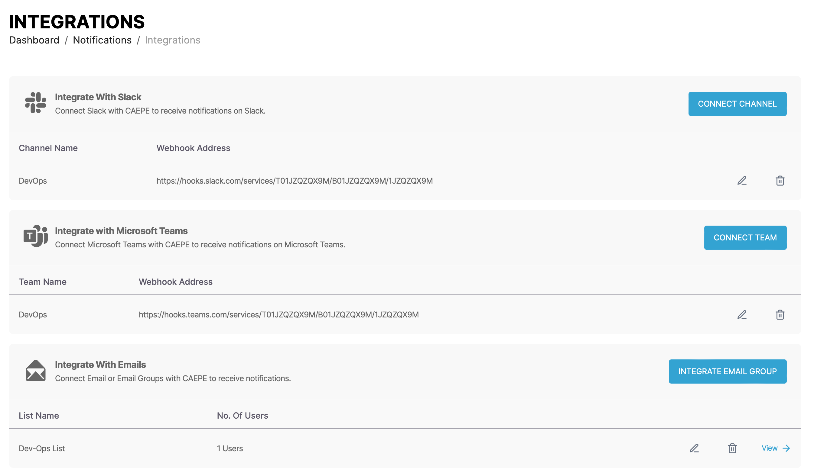
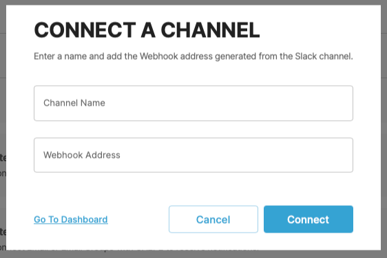
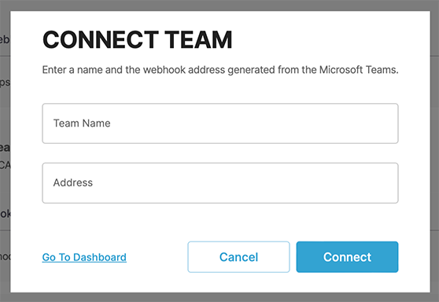
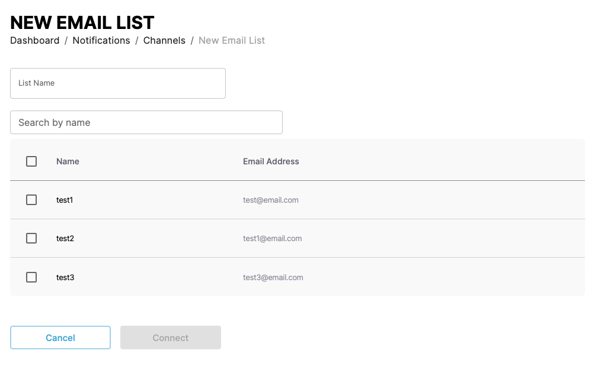
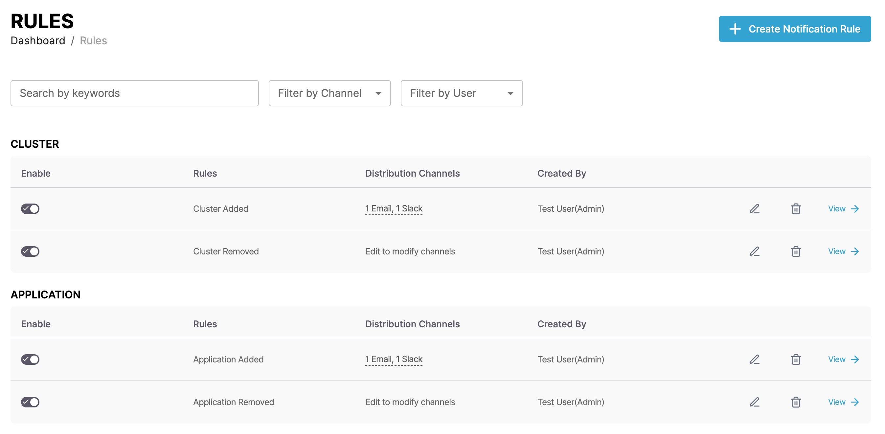
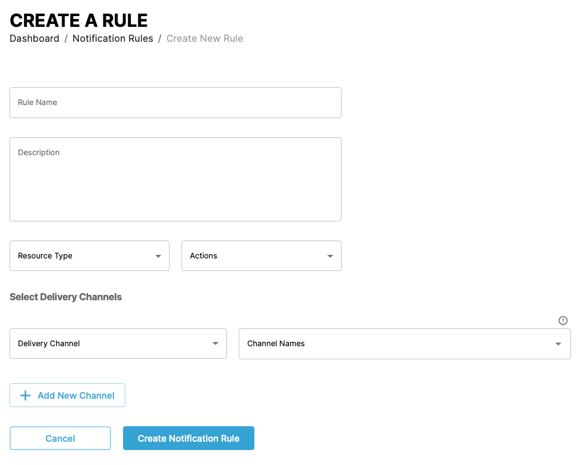

# Managing notifications

This guide shows you how to manage notifications and rules from the CAEPE account portal. You can access the configuration section from the _CAEPE Management_ -> _Notifications_ menu item.

!!! info

    _Notifications_ are messages sent to external services when CAEPE detects a change in status. You can configure notifications to be sent to Email, Microsoft Teams, or Slack. _Rules_ are used to determine when a notification is sent.

## Integrations

<!-- TODO: Update image -->

You can see the integrations associated with your account in the center of the page, split by CAEPE resource type.

Each item in the list shows the service name, details of the integration, such as webhook URL or number of users in an email group. Click the _pencil_ icon to edit the integration and the _wastebasket_ icon to delete it.

### Integration details

Click the _View_ link next to an integration type to see more details about the integration. You can also edit and delete the integration from the details page.

## Create a notification integration

### Slack

Create an integration to send notification messages to Slack by clicking the _Integrate a channel_ button.

Set a channel name and a webhook URL for the service.

### Microsoft Teams

Create an integration to send notification messages to Microsoft Teams by clicking the _Integrate a team_ button.

### Email

Create an integration to send notification messages to email by clicking the _Integrate Email group_ button.

Set a group name and select the users to add to the list.

## Notification rules

You can see the notification rules associated with your account in the center of the page, split by CAEPE resource type.

You can filter the rules by keyword, channel, and user.

Each entry in the list shows the name of the rule, status of the rule, distribution channel, and the creator of the rule. Click the _pencil_ icon to edit the rule and the _wastebasket_ icon to delete it.

### Rule details

Click the _View_ link next to a rule to see more details. You can also edit and delete the rule from the details page.

<!-- TODO: Add image, link doesn't work -->

### Create a notification rule

Create a notification rule by clicking the _Create notification rule_ button.

Provide a name and description for the rule. Select the resource type and action that triggers the rule. Select the integration and provide details such as channels or names to send the notifications to.