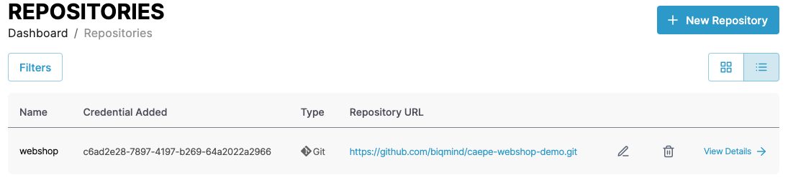
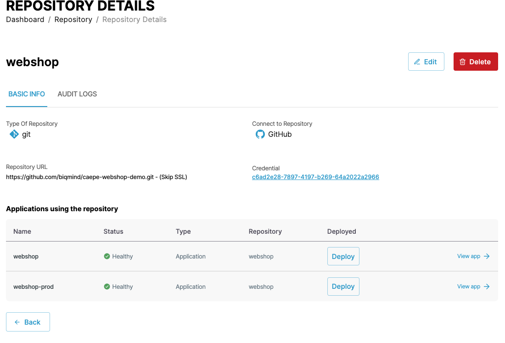
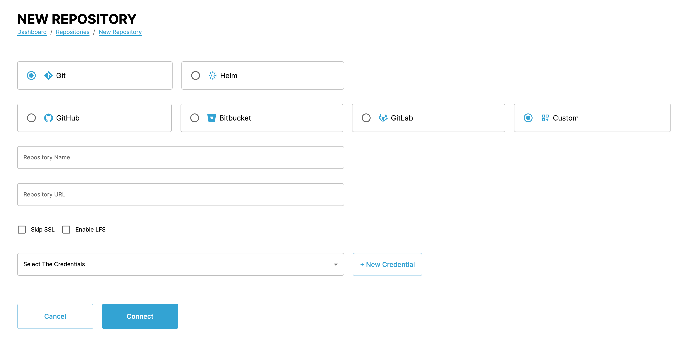
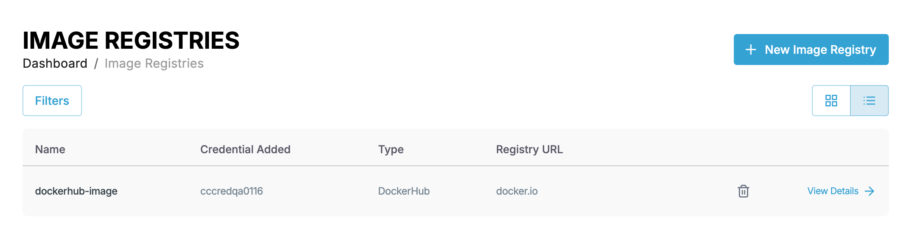
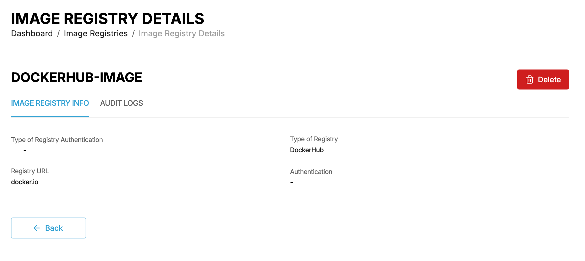
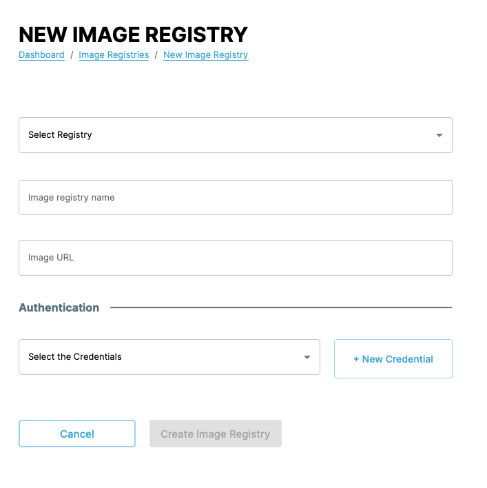

# Managing application source

You can follow the steps in the following demo video or follow the the instructions in the following sections to use the various CAEPE features.

<iframe width="854" height="480" src="https://www.youtube.com/embed/2ZdveSky0EU?si=If3j2Cksc01dLt2j" title="YouTube video player" frameborder="0" allow="accelerometer; autoplay; clipboard-write; encrypted-media; gyroscope; picture-in-picture; web-share" allowfullscreen></iframe>

This guide shows you how to manage application sources from the CAEPE account portal. You can access the configuration section from the _Configuration_ -> _Application Source_ menu item.

!!! info

    An **application source** represent where CAEPE can find the definition of an application. This definition source can be from a repository or a container image registry.

## Repositories

### Viewing repositories

You can see the repositories associated with your account in the center of the page.

You can switch the view of the repositories between a "list" and "grid" view and filter the applications by clicking the _Filters_ button. You can filter by repository name, status, and type.

Each entry in the list or grid shows the current status of the repository, the type it uses, and its URL source. Click the _pencil_ icon to edit the cluster or the _wastebasket_ icon to delete it.

#### Repository details

Click the _View Details_ link next to any repository to see more details about the application including the type, the credentials used, and any applications using the repository. You can also edit and delete the repository from the details page.

### Connect a repository

Connect a repository by clicking the _New Repository_ button.

For each repository, select the type and the location. CAEPE supports application definitions stored in the following repository types:

- Git
- Helm

And stored in the following locations:

- GitHub
- Bitbucket
- Gitlab
- Custom location

Next, set a name for the repository and its URL.

!!! Info

    - The URL must end in _.git_.
    - CAEPE processes Git repositories for deployments exclusively using .yml or .yaml files, ignoring all other file types.

Create or select the credentials to use to access the repository.

!!! Info
    
    To connect a GitHub repository using a Personal Access Token (PAT), select Username as the Credential Type in CAEPE. Enter your GitHub account username as the Username and the PAT as the Password.

You can also disable SSL connections or enable large file storage (LFS) if the repository you are connecting to uses it.

## Image registries

### Viewing image registries

You can see the image registries associated with your account in the center of the page.

You can switch the view of the registries between a "list" and "grid" view and filter the applications by clicking the _Filters_ button. You can filter by credential name used, status, and type.

Each entry in the list or grid shows the credentials used, the type, and its URL source. Click the _pencil_ icon to edit the registry or the _wastebasket_ icon to delete it.

#### Image registry details

Click the _View Details_ link next to any registry to see more details including the type, URL, and authentication used. You can also edit and delete the registry from the details page.

### Connect an image registry

Connect an image registry by clicking the _New Image Registry_ button.

For each image registry, select the location, the name, and image URL. CAEPE supports application definitions stored in the following image registries:

- ECR
- ACR
- GCR
- Harbor
- Docker Hub
- Custom locations

!!! Info

    When adding a DockerHub image registry to CAEPE, always set the Registry URL to docker.io.

Next, create or select the credentials to use to access the registry.
