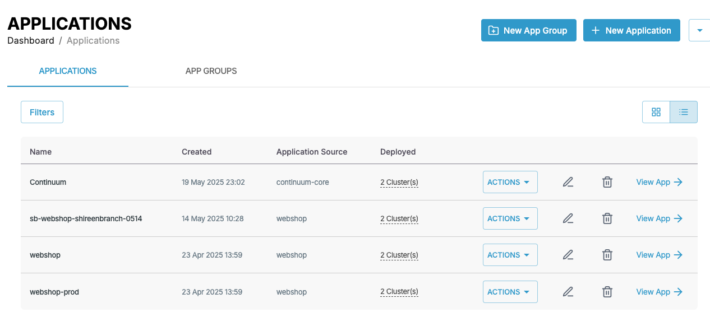
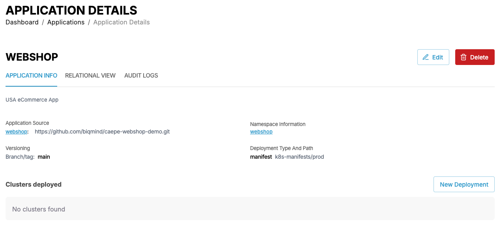
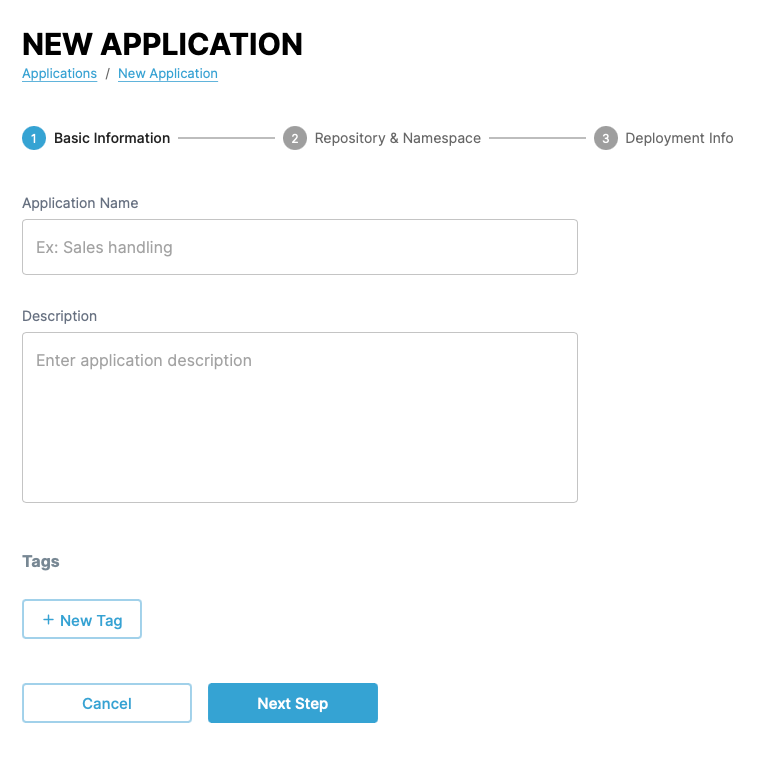
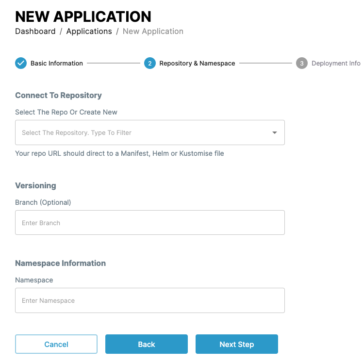
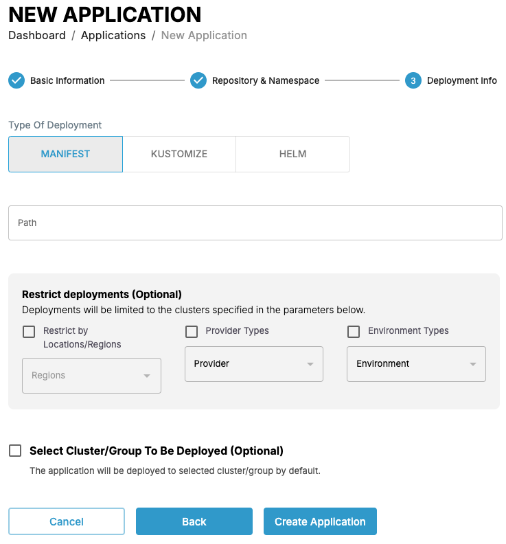
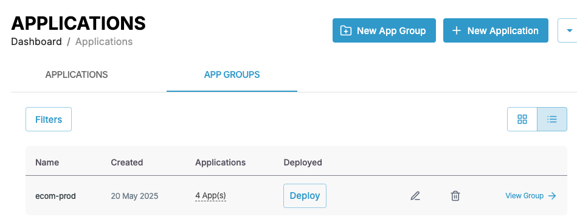
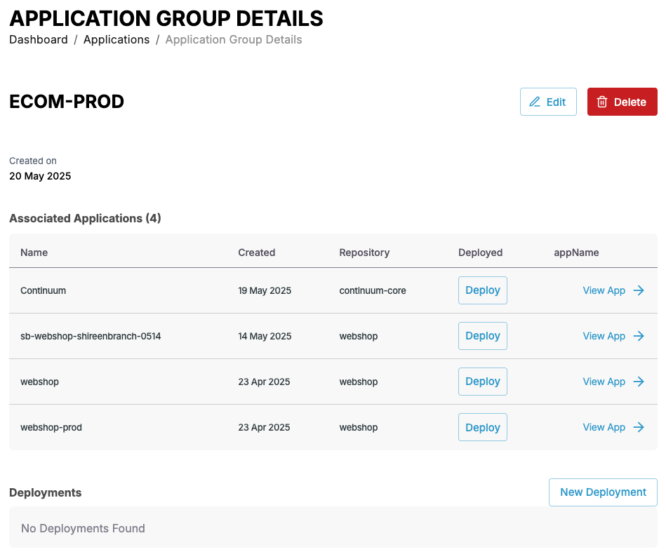
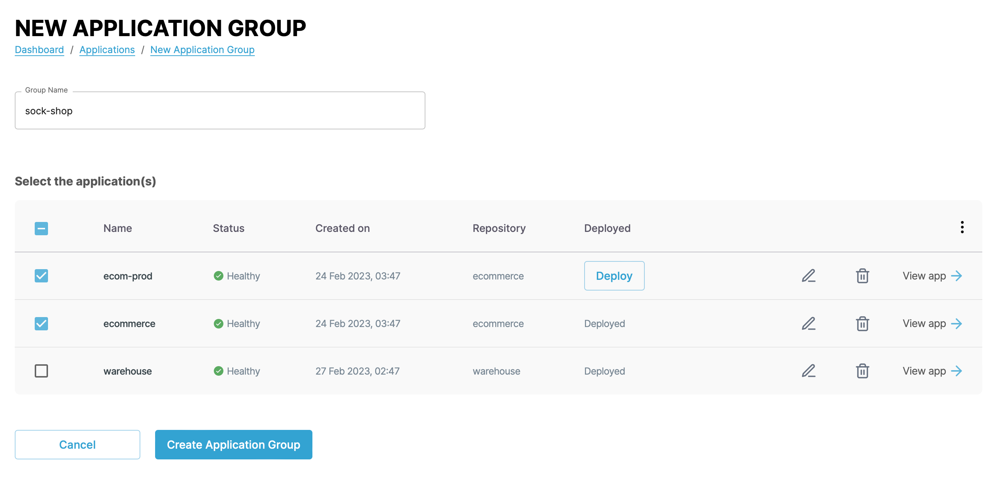

# Managing applications and application groups

You can follow the steps in the following demo video or follow the the instructions in the following sections to use the various CAEPE features.

<iframe width="854" height="480" src="https://www.youtube.com/embed/_6l6-yapXfA?si=-lVxEtdOXKyYhCCP" title="YouTube video player" frameborder="0" allow="accelerometer; autoplay; clipboard-write; encrypted-media; gyroscope; picture-in-picture; web-share" allowfullscreen></iframe>

This guide shows you how to manage applications and application groups from the CAEPE account portal. You can access the configuration section from the _Configuration_ -> _Applications_ menu item.

!!! info

    **Applications** represent an instance of an application running on a cluster or cluster group. **Application groups** are logical groups of applications running on a cluster or cluster group.

## Viewing applications

<!-- TODO: Temp screenshot -->

You can see the applications associated with your account in the center of the page by clicking the _Applications_ tab, which is selected by default.

You can switch the view of the applications between a "list" and "grid" view and filter the applications by clicking the _Filters_ button. You can filter by application name, status, and type.

Each entry in the list or grid shows the current status of the application, the repository it uses, and its deployment status. Click the _pencil_ icon to edit the application and the _wastebasket_ icon delete to delete it.

<!-- TODO: Sync all apps? -->

### Application details

Click the _View app_ link next to any application to see an overview of the detail of the application and any clusters the application is currently deployed to. You can also edit and delete the application from the details page.

## Create an application

Create an application by clicking the _New Application_ button.

In the first step of the form, set a name and description for the application, and any metadata tags you want to add.

In the next step, select the repository that contains the definition of the application, the branch of the repository to use, and the namespace to use or create for the application.

!!! warning

    When you delete an application, **CAEPE doesn't delete the associated namespace**. You need to manually delete the namespace using `kubectl`, for example, `kubectl delete namespace {NAMESPACE_NAME}`

In the last step, select the type of deployment and the path to the files in the repository that define that application.

CAEPE supports the following application types:

- Kubernetes manifest files in YAML or JSON
- Helm charts
- YAML
- Custom

<!-- TODO: Clusters and groups yet to be implemented -->

## Viewing application groups

You can see the application groups associated with your account in the center of the page by clicking the _App Groups_ tab.

You can switch the view of the application groups between a "list" and "grid" view and filter the applications by clicking the _Filters_ button. You can filter by application group name, status, and type.

Each entry in the list or grid shows the current status of the application group, the applications part of it, and its deployment status. Click the _pencil_ icon to edit the application group or the _wastebasket_ icon  to delete it.

### Application group details

Click the _View Group_ link next to any application group to see an overview of the detail of the application group and any applications and deployments associated with the agroup. You can also edit and delete the group from the details page.

## Create an application group

Create an application group by clicking the _New Application Group_ button.

Give the application group a name, select the applications to add to the group from the list below, and click the _Create Application Group_ button.