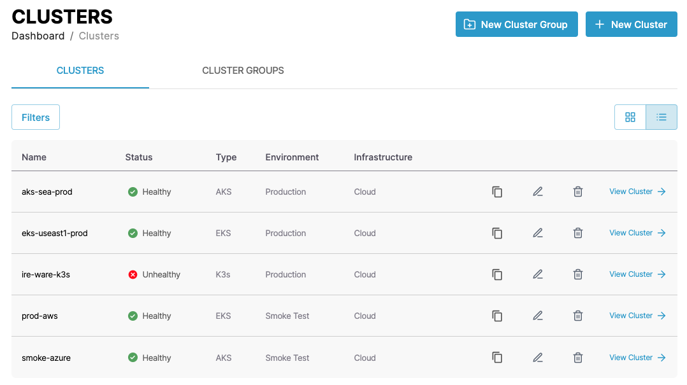
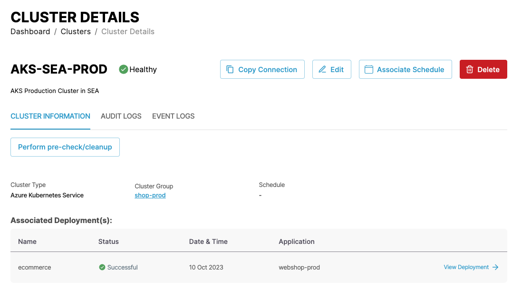
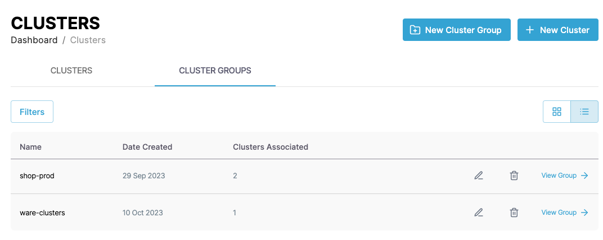
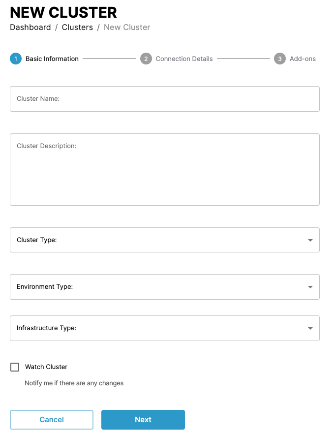
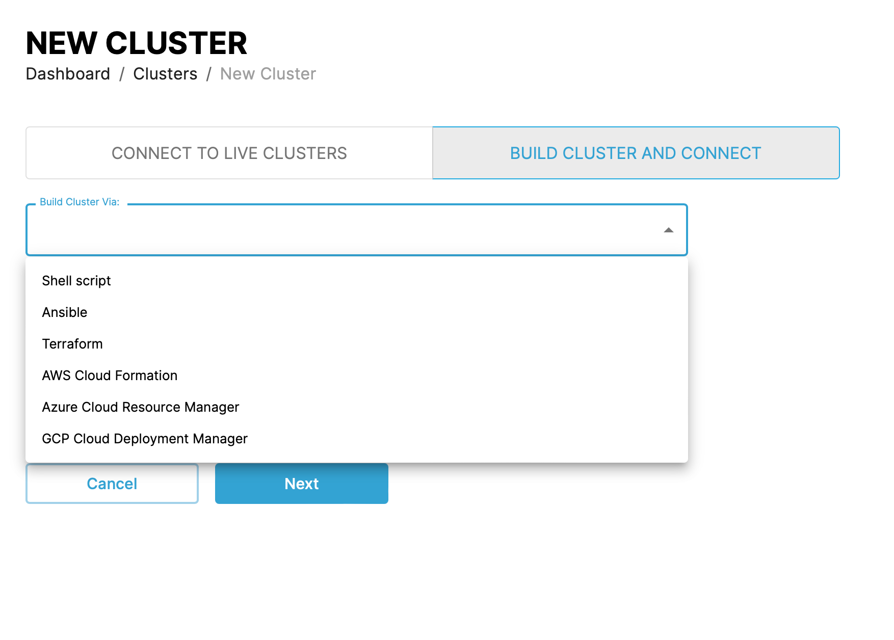
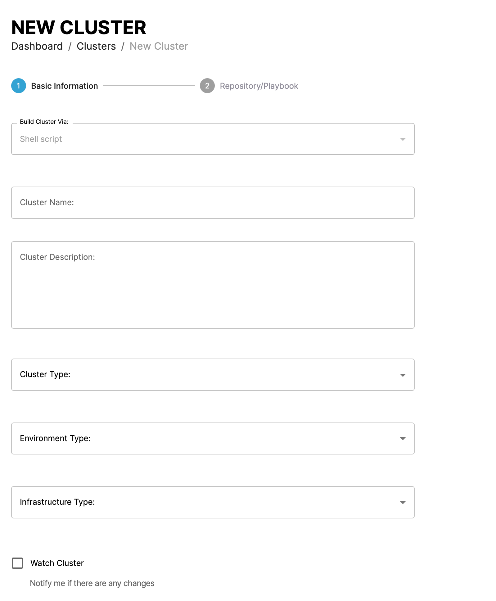
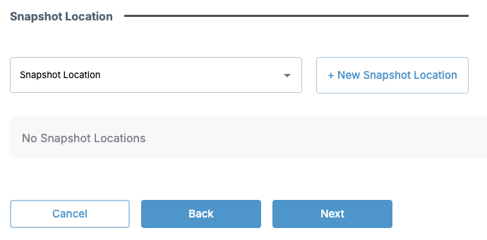
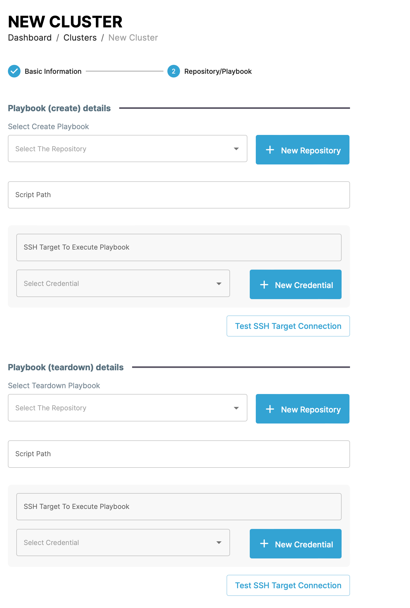
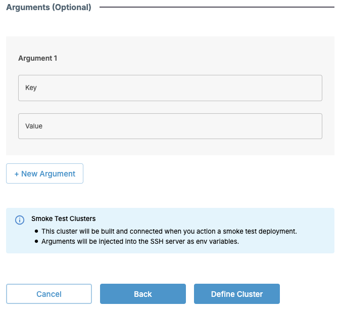
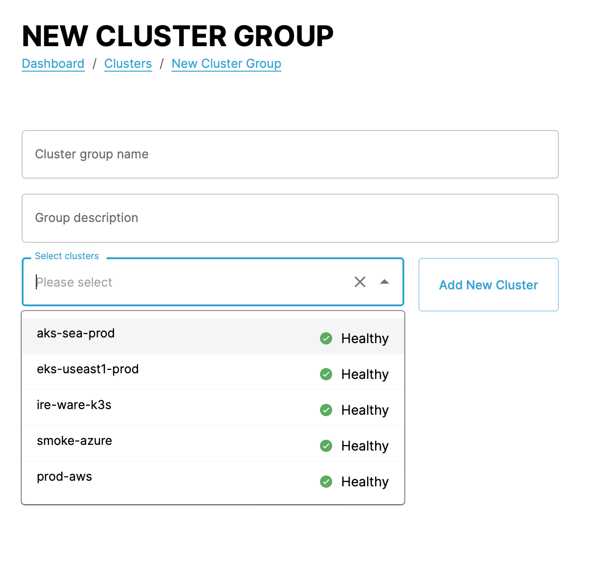

# Managing clusters and cluster groups

You can follow the steps in the following demo video or follow the the instructions in the following sections to use the various CAEPE features.

<iframe width="854" height="480" src="https://www.youtube.com/embed/3ycCWVGufO0?si=IMcQMVvYY3ocE3H5" title="YouTube video player" frameborder="0" allow="accelerometer; autoplay; clipboard-write; encrypted-media; gyroscope; picture-in-picture; web-share" allowfullscreen></iframe>

This guide shows you how to manage clusters and cluster groups from the CAEPE account portal. You can access the configuration section from the _Configuration_ -> _Clusters_ menu item.

!!! info

    **Clusters** represent Kubernetes instances connected to your CAEPE account, and **cluster groups** are logical groups of clusters.

## Viewing clusters



You can see the clusters associated with your account in the center of the page.

You can switch the view of the clusters between a "list" and "grid" view and filter the clusters by clicking the _Filters_ button. You can filter by cluster name, status, and type.

For every cluster in the list, click the _pencil_ icon to edit the cluster or the _wastebasket_ icon to delete it.

### Cluster details



Click the _View Cluster_ link next to any cluster to see more details about the cluster including the name, type, groups, connection details, and any past and present applications deployed to the cluster.

You can also create [deployment schedules](./schedules.md#create-a-schedule) from the cluster details page and perform pre-checks or cleanup tasks on the cluster.

You can also edit and delete the cluster from the details page.

## Viewing cluster groups



You can see the cluster groups associated with your account in the center of the page.

You can switch the view of the cluster groups between a "list" and "grid" view and filter the cluster groups by clicking the _Filters_ button. You can filter by cluster group name, status, and association.

## Connect a cluster

<!-- For non-http connection, refer to FAQs for more info -->

!!! info

    By default, only HTTPS connection is allowed. 

!!! warning
    
    To minimize deployment issues, we recommend that the clusters you connect to CAEPE are new and unused, as clusters with previously deployed apps via other methods may cause errors.


Connect a cluster by clicking the _New Cluster_ button.

You can connect to a currently live cluster or build a cluster and connect.

In the form that appears, set a name and description for the cluster and a region.

Set the cluster type based on where the cluster is running. CAEPE supports clusters running on multiple Kubernetes providers, including:

- Amazon EKS <!--(see the note below for specific connection requirements)--> 
- Azure AKS
- Google GKE
- Lightweight Kubernetes (K3s) running on private clusters and on-premises
- Kubernetes running on private clusters and on-premises
- OCI Container Engine for Kubernetes
- Rancher Kubernetes engine

<!--

??? info "Only for Amazon EKS connection"

    Amazon EKS connection requires additional RBAC implementation to AWS IAM. You need to create a service account and update the kubeconfig file to use the Service Account as the login user. Connect into the EKS cluster (through AWS cloud shell or any other preferred method), and use the following steps and commands. 

    <b>Note</b> Use the provided “sample” service account name as a reference only. Create a new service account and replace the “sample” service account name with your specific service account name in all commands.

    Create a service account.
    ``` 
    kubectl -n kube-system create serviceaccount sample-sa
    ```
    Grant cluster-admin to the service account.
    ``` 
    kubectl create clusterrolebinding sample-rb --clusterrole=cluster-admin --serviceaccount=kube-system:sample-sa
    ``` 
    Extract the service account token.
    ``` 
    sa_token_name=`kubectl -n kube-system get serviceaccount/sample-sa -o jsonpath='{.secrets[0].name}'`
    sa_token=`kubectl -n kube-system get secret $sa_token_name -o jsonpath='{.data.token}'| base64 --decode`
    ``` 
    Set credentials.
    ``` 
    kubectl config set-credentials sample-sa --token=$sa_token
    ``` 
    Update kubeconfig file and set the current context user as our service account.
    ``` 
    kubectl config set-context --current --user=sample-sa
    ```  
    The kubeconfig will be updated, and use the service account as the user for the current context. 

    <b>Testing:</b> Copy the kubeconfig file into a fresh machine which doesn’t have AWS SDK or any other component installed. Execute a test command. 
    ``` 
    kubectl get nodes -o wide --kubeconfig $KUBECONFIG-FILE
    ```
    The command should complete successfully.
--> 

Set the environment type based on how you intend to use the cluster. The options are:

- Development
- Production
- QA
- Staging
- Smoke test
- UAT
- Others

Set the infrastructure type based on how the cluster is hosted. The options are:

- Edge
- On-Prem
- Cloud
- Airgapped


### Live cluster



For the connection details you can connect by uploading a [kube config](https://kubernetes.io/docs/concepts/configuration/organize-cluster-access-kubeconfig/){:target="_blank"} file for the cluster or by generating a kubectl execute command to paste into your terminal.

### Build and connect



If you choose the _Build cluster and connect_ option, the creation form shows the various options for building a cluster, these are:

- Run a shell script
- An Ansible playbook
- A Terraform definition file
- An AWS CloudFormation template
- An Azure Cloud Resource Manager template
- A GCP Deployment Manager template



After selecting the build method, in the next step add a name and description for the cluster and the cluster, environment, and infrastructure type. You can also watch the cluster for changes and use [a notification integration](../caepe_management/notifications.md) to send notifications when the cluster state changes.



Select the snapshot location or create a new [snapshot location](../smoke_tests.md#define-a-snapshot)



Use the next section to add playbooks to run on creation and teardown of a cluster. This example uses Anisble. You host these scripts in [repositories](./application_source.md#repositories) defined in the _Application source_ -> _Repositories_ section and they should contain the appropriate resource type to match the build option you selected.



!!! info

    You need an SSH credential defined to use and execute the playbook scripts.

### After creation steps

When you create a cluster you can add it to a logical grouping of clusters. You can select a pre-existing group, or create a new one.

!!! info

    If you add the cluster to a pre-existing group that has an application defined for it, CAEPE automatically deploys that application to the new cluster.

When the Pods are ready, the cluster shows in the list with a "Healthy" state.

!!! info

    There are a few reasons a cluster remains in an "unhealthy" state.

    It could be network connectivity, such as changes to firewall rules or network changes at the cluster. It could be a cluster issue, such as a cluster down for maintenance, due to problems, or the cluster has been deleted but not removed from Caepe, etc.

## Create a cluster group

Create a cluster group by clicking the _New Cluster Group_ button.



In the form that appears, set a name and description for the cluster group and select the clusters to add to the group. You can select a pre-existing cluster, or create a new one.
