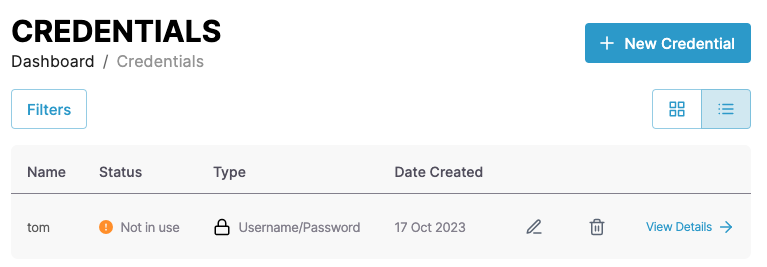
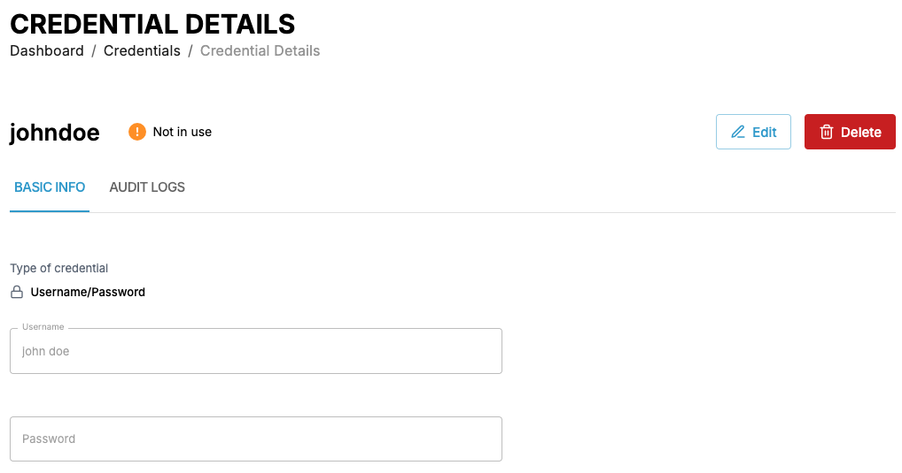
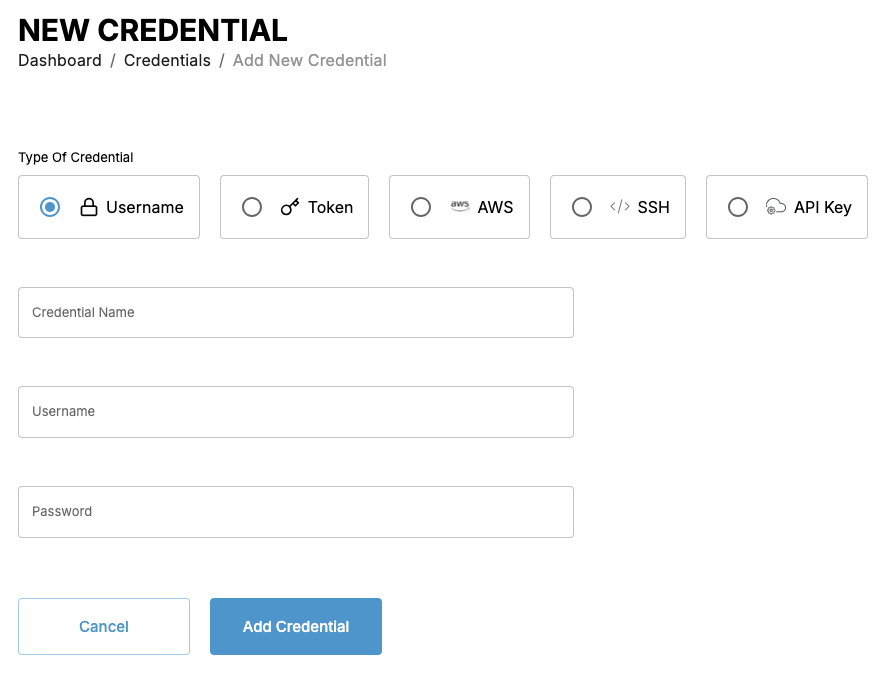

# Managing credentials

You can follow the steps in the following demo video or follow the the instructions in the following sections to use the various CAEPE features.

<iframe width="854" height="480" src="https://www.youtube.com/embed/4vya_zuVYwE?si=uHycpONzoCZ276a8" title="YouTube video player" frameborder="0" allow="accelerometer; autoplay; clipboard-write; encrypted-media; gyroscope; picture-in-picture; web-share" allowfullscreen></iframe>

This guide shows you how to manage credentials from the CAEPE account portal. You can access the configuration section from the _Configuration_ -> _Credentials_ menu item.

!!! info

    A **Credential** represents the user account and token details needed to access private repositories and servers.

## Viewing credentials

You can see the credentials associated with your account in the center of the page.

You can switch the view of the credentials between a "list" and "grid" view and filter the credentials by clicking the _Filters_ button. You can filter by credential name, status, and type.

Each entry in the list or grid shows the current status of the application, the repository it uses, and its usage status. Click the _pencil_ icon to edit the cluster or the _wastebasket_ icon to delete it.

### Credential details

Click the _View Details_ link next to any credential to see more details about the credential including the type, the username and password or name and key, and any repository using the credential. You can also edit and delete the credential from the details page.

## Add credentials

Create a credential by clicking the _New Credential_ button.

In the form that appears, set a type, name and details for the credential. The details depend on the type you select and are described below.

- A username and password combination.
- A token for authentication. This includes SSH keys, Oauth, or personal access tokens.

!!! info

    Changing SSH credential types requires creating a new credential. After creating an SSH credential as either interactive or non-interactive, you can edit the username and password but not change the it’s type. To switch between interactive and non-interactive, create a new credential with the desired type, update any repositories or image registries using the old credentials to the newly created credential, then delete the old credential.

- An AWS credential for accessing the AWS ECR containing the following:
  - Region
  - Access Key
  - Secret Key
  - Account ID