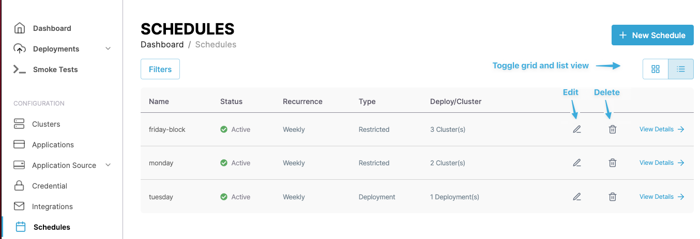
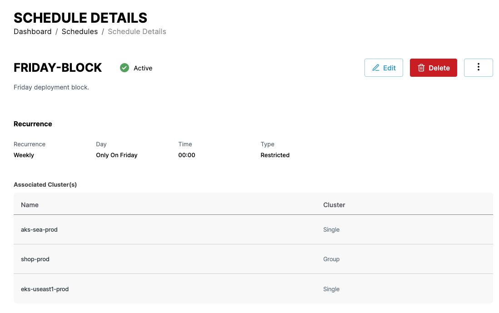
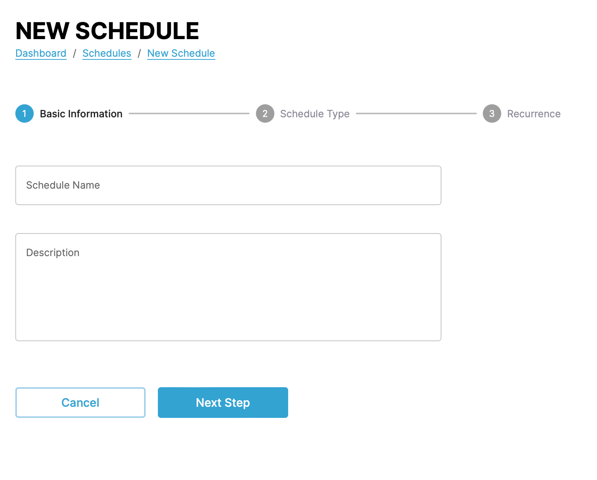
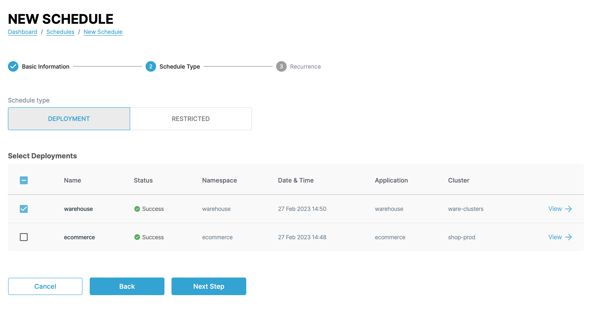
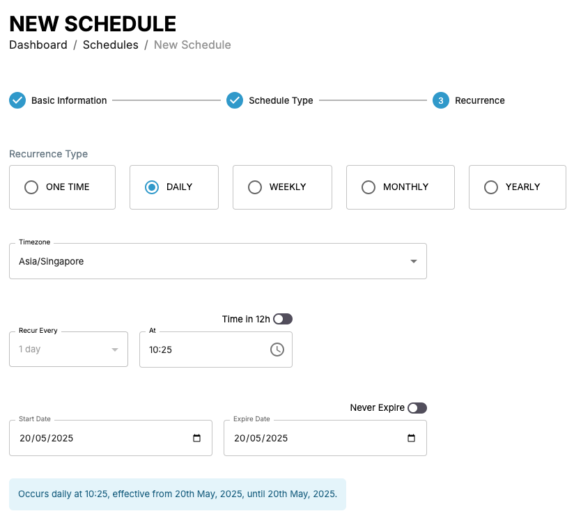
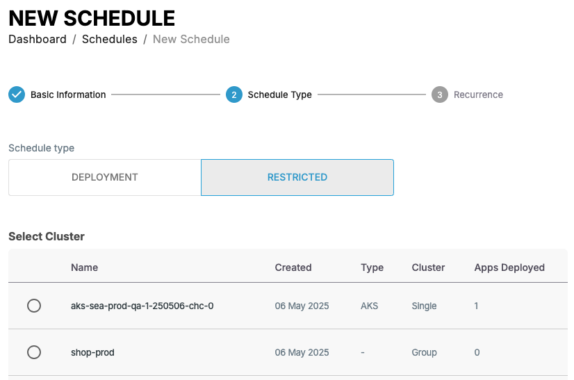

# Managing schedules

You can follow the steps in the following demo video or follow the the instructions in the following sections to use the various CAEPE features.

<iframe width="854" height="480" src="https://www.youtube.com/embed/eMA8v3kUTWU?si=mAs2eXaOk2mq7BQX" title="YouTube video player" frameborder="0" allow="accelerometer; autoplay; clipboard-write; encrypted-media; gyroscope; picture-in-picture; web-share" allowfullscreen></iframe>

This guide shows you how to manage schedules from the CAEPE account portal. You can access the configuration section from the _Configuration_ -> _Schedules_ menu item.

!!! info

    **Schedules** represent an automated recurring deployment of an application to a cluster.

## Viewing schedules

You can see the schedules associated with your account in the center of the page.

You can switch the view of the schedules between a "list" and "grid" view and filter the schedules by clicking the _Filters_ button. You can filter by schedule name, status, and type.

Each entry in the list or grid shows the current status of the schedule, its schedule, type, and cluster deployment. Click the _pencil_ icon to edit the cluster and the _wastebasket_ icon  to delete it.

### Schedule details

<!-- TODO: Not yet available -->

Click the _View Details_ link next to any schedule to see more details about the schedule including the type, the credentials used, and any applications using the schedule. You can also edit and delete the schedule from the details page.

## Create a schedule

Create a schedule by clicking the _New Schedule_ button. CAEPE has two types of schedule:

- **Deployment**: For deploying an application to a deployment.
- **Restricted**: For blocking an application deployment to a deployment.

### Deployment

In the first step, give the schedule a name and a description.

In the next step, select the schedule type and the deployments to include in the schedule.

In the final step, set the schedule for the deployment.

### Restricted

In the first step, give the schedule a name and a description.

In the next step, select the schedule type and the deployments to include in the schedule.

In the final step, set the schedule for the restriction.

