# Deployments

This guide shows you how to manage deployments from the CAEPE account portal. You can access the section from the _Deployments_ menu item.

!!! info

    **Deployment** is the process of making software available to be used on a system by users and other programs.

## Viewing deployments

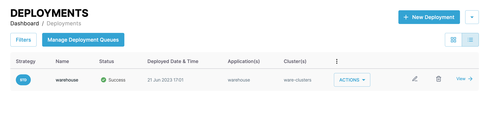

You can see the deployments associated with your account at the center of the page.

You can switch the view of the deployments between a "list" and "grid" view and filter the deployments by clicking the _Filters_ button. You can filter by deployment name, status, and strategy type.

Each entry in the list or grid shows [the deployment strategy](#deployment-strategies) the deployment strategy, name, status, deployed date & time, deployed application, cluster on which application is deployed, and an <b>actions</b> button. Click the _pencil_ icon to edit the deployment and the _wastebasket_ icon delete to delete it.

### Deployment details

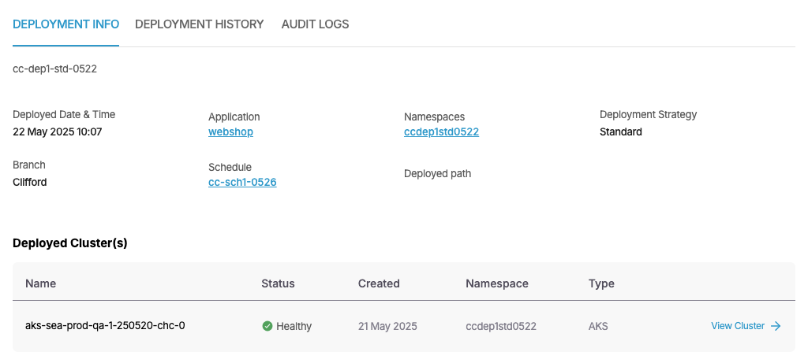

Click the _View Details_ link next to any deployment to see more details about the deployment including the deployment date and time, branch, application, scheduler used, namespace, path of deployment manifests, and [deployment strategy](#deployment-strategies).

The _Deployed Differences_ section shows the difference between the requested objects by the deployment and the objects which are actually deployed.

The _Deployed Clusters_ list shows the clusters on which the application is deployed.

Click the _Deployment History_ tab to see a history of the deployment.

<!--

deployment history image missing 

-->

You can also edit and delete the deployment from the details page and perform <b> other actions </b>.

## Deployment strategies

CAEPE supports six deployment strategies.

!!! info
    Deployment strategies are declarative statements usually configured in a manifest file that defines the application lifecycle and how updates to that application should be applied.

!!! warning
    
    To minimize deployment issues, we recommend that the clusters you connect to CAEPE are new and unused, as clusters with previously deployed apps via other methods may cause errors.    

### Standard deployments

Standard strategy deploys an application to a specific environment, with an environment consisting of a cluster and a namespace..

Create a standard deployment by clicking the _New Deployment_ button from the _Deployments > Deployments List_ menu or the _Create Deployment_ button from the _Deployments > Deployment Strategies_ menu.

Give the deployment a name and description, select an application to deploy, provide other optional information if required i.e (namespace, branch/tag or chart version).

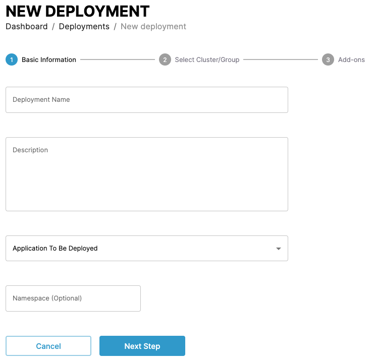

In the next step, select the cluster or cluster group to deploy the application to.

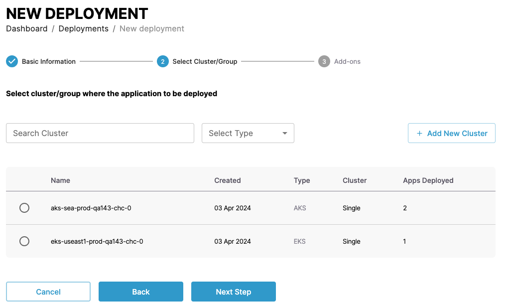

<!--

deployment history image missing 

-->

### A/B deployments

Deploys two versions of an application available to specific users. A/B strategy deploys two versions of an application that are only available to a subset of users. These users are selected based on specific conditions and parameters the engineers choose.

Create an A/B deployment by clicking the _Create A/B Deployment_ button from the _Deployments > Deployment Strategies_ menu.

First give the deployment a name and description, and select an application to deploy.

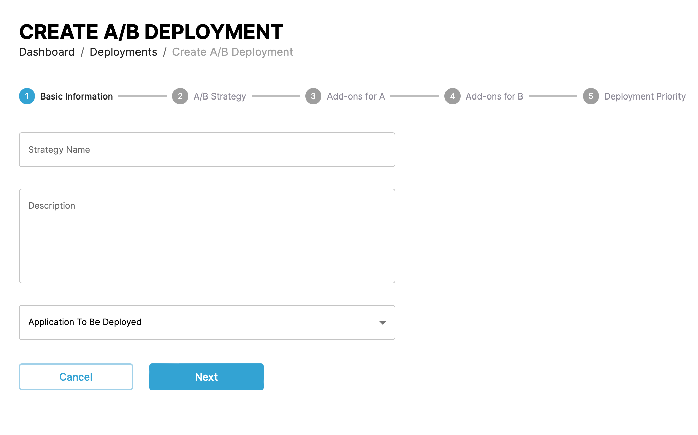

In the next step you define the A/B strategy to use. This can be either deploying the two applications to different clusters or to same cluster but different namespaces.

In the next steps, select add-ons for the A and B deployments. These can include:

- **Recommended actions**:
    - **Pre-flight tests**
    !!! Prerequisites
        **Pod level** services need to be install for preflight to work, e.g installed postgres/mysql/mariadb
    !!! info
        - Results returned from the pre-flight test are a direct output from Kubernetes
        - **Nginx version** by default is NA as nginx is at the global level and not at the pod level; thus, version is not returned by Kubernetes
    - Executing a **dry run** of the application deployment.
    - **Scan for latest changes** in manifests that define the application.
- **Deployment arguments**: Pass arguments to the deployment through placeholder variables in the application definition.
- **Estimate time & size**: Estimate the time and size of the application deployment.
- **Post deployement actions**: SSH and Webhook options to configure for post deployment actions. 
- **Priority**: Set the deployment priority for the new version, defining which applications CAEPE deploys in which order. 

In the final step, select the deployment priority for both versions, defining which applications CAEPE deploys in which order.

### Blue/Green deployments

Blue/Green strategy deploys a new version of the application that runs alongside the old version. Once certified to meet all the requirements, the traffic switches from the older (blue) version to the newer (green) version.

Give the deployment a name and description, select an application to deploy, provide other optional information if required i.e (namespace, branch/tag or chart version).

Optionally enable automatic deployment to trigger when any change is made on any of the resources associated with this deployment and enable rollbacks to switch to the previous application version in case of error.
!!! Info
    CAEPE ONLY uses native K8S rollback which will not includes CRDs.

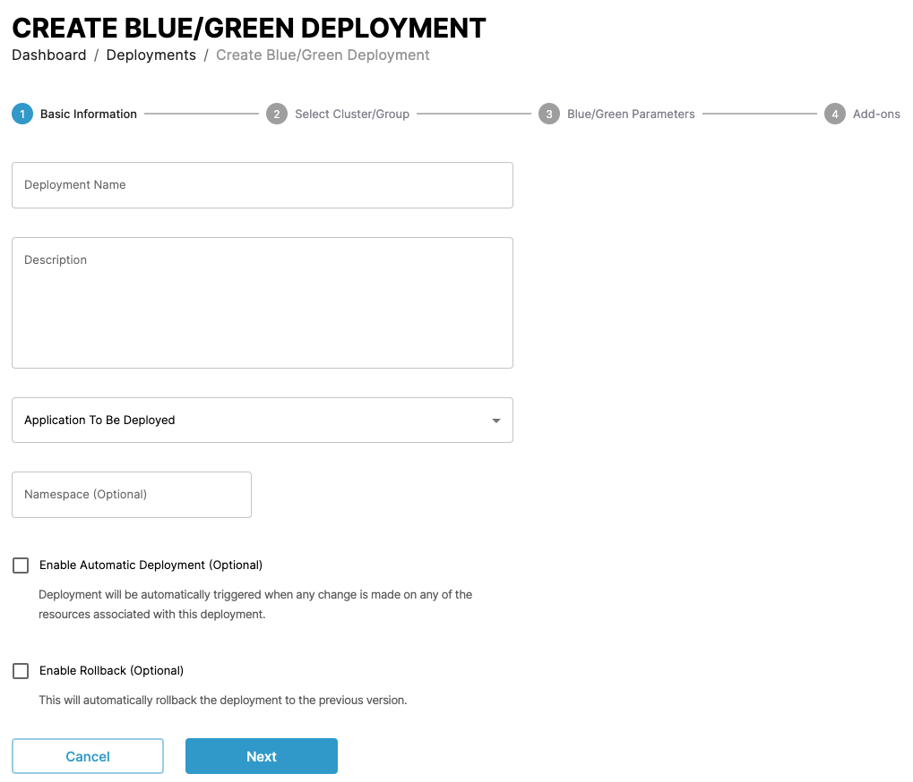

In the next step, select the cluster or cluster group to deploy the application to.

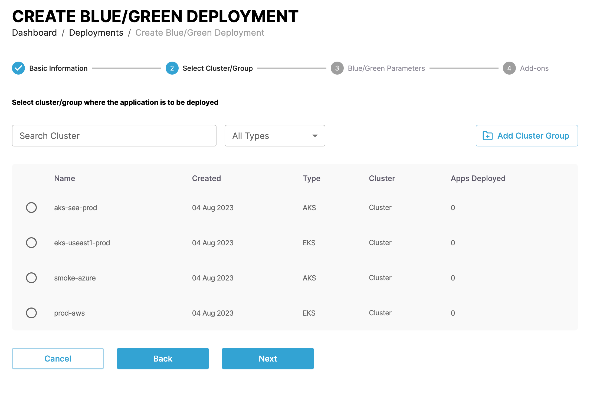

The next step shows the configuration for blue/green deployment strategy. Read more about `MaxSurge` and `MaxUnavailable` [in the Kubernetes documentation](https://kubernetes.io/docs/concepts/workloads/controllers/deployment/).

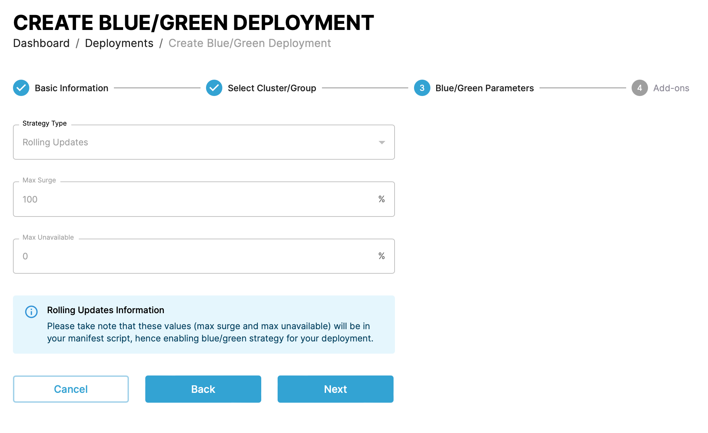

In the final step, select add-ons for the deployment. These can include:

- **Recommended actions**:
    - **Pre-flight tests**
    !!! Prerequisites
        **Pod level** services need to be install for preflight to work, e.g installed postgres/mysql/mariadb
    !!! info
        - Results returned from the pre-flight test are a direct output from Kubernetes
        - **Nginx version** by default is NA as nginx is at the global level and not at the pod level; thus, version is not returned by Kubernetes
    - Executing a **dry run** of the application deployment.
    - **Scan for latest changes** in manifests that define the application.
- **Deployment arguments**: Pass arguments to the deployment through placeholder variables in the application definition.
- **Estimate time & size**: Estimate the time and size of the application deployment.
- **Post deployement actions**: SSH and Webhook options to configure for post deployment actions. 

### Canary deployments

Canary strategy deploys a new version that gradually shifts production traffic from the older version to the newer version to test new functionality on a subset of users before releasing it to the entire user base.

!!! Prerequisites
    Ingress needs to be installed before using Canary deployments

First give the deployment a name and description.

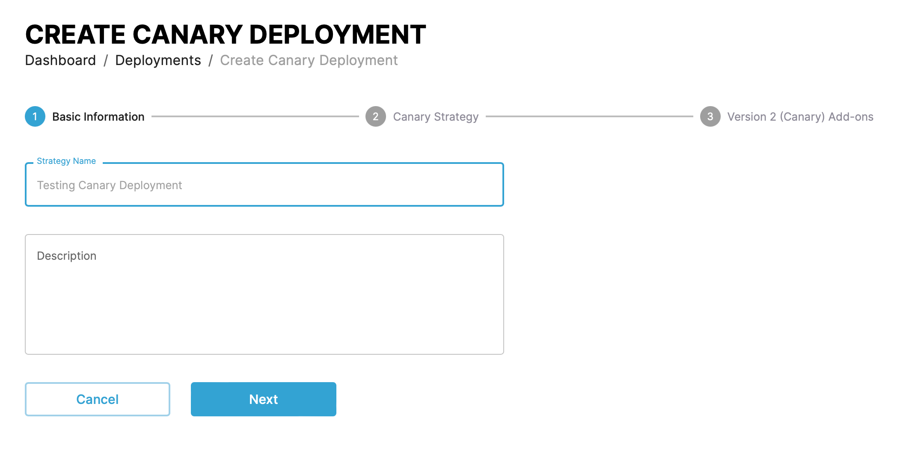

In the next step you configure the two versions.

For version one, you select an existing deployment which defines the application, namespace and destination cluster group to use.

In the version one column you set the percentage of traffic split between the versions.

For version two, you set a name along with an optional branch and namespace along with a cluster group to deploy to.

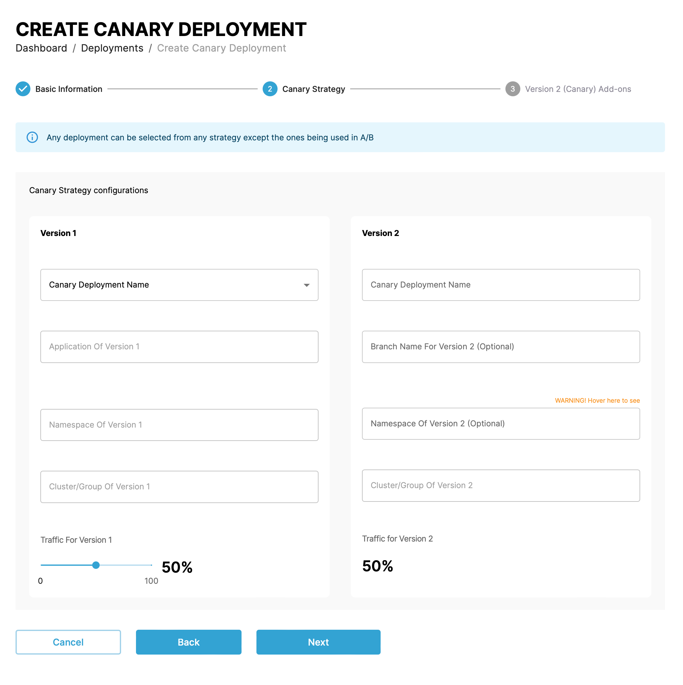

In the final step, select add-ons for the version two deployment. These can include:

- **Recommended actions**:
    - **Pre-flight tests**
    !!! Prerequisites
        **Pod level** services need to be install for preflight to work, e.g installed postgres/mysql/mariadb
    !!! info
        - Results returned from the pre-flight test are a direct output from Kubernetes
        - **Nginx version** by default is NA as nginx is at the global level and not at the pod level; thus, version is not returned by Kubernetes
    - Executing a **dry run** of the application deployment.
    - **Scan for latest changes** in manifests that define the application.
- **Deployment arguments**: Pass arguments to the deployment through placeholder variables in the application definition.
- **Estimate time & size**: Estimate the time and size of the application deployment.
- **Post deployement actions**: SSH and Webhook options to configure for post deployment actions. 

### Recreate/Highlander deployments

Recreate/Highlander strategy deletes the old version of the application entirely and then deploys the new version of the application causing downtime during transition.

Give the deployment a name and description, select an application to deploy, provide other optional information if required i.e (namespace, branch/tag or chart version).

Optionally enable automatic deployment to trigger when any change is made on any of the resources associated with this deployment and enable rollbacks to switch to the previous application version in case of error.
!!! Info
    CAEPE ONLY uses native K8S rollback which will not includes CRDs.

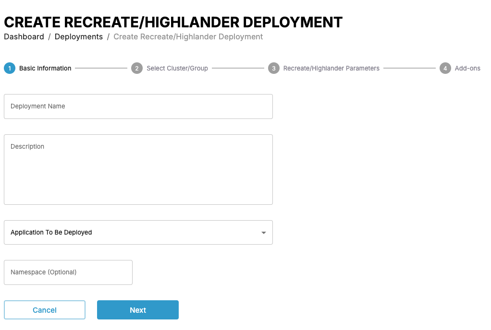

In the next step, select the cluster or cluster group to deploy the application to.
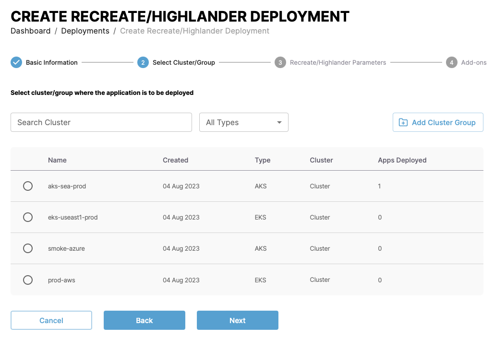

The next step shows the configuration for recreate/highlander deployment strategy. Read more about Recreate in the Kubernetes documentation.

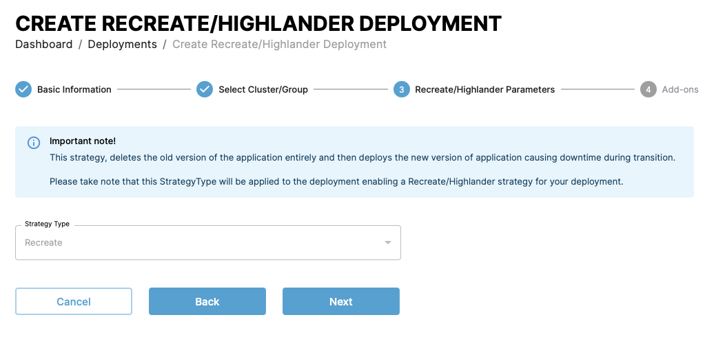

In the final step, select add-ons for the deployment. These can include:

- **Recommended actions**:
    - **Pre-flight tests**
    !!! Prerequisites
        **Pod level** services need to be install for preflight to work, e.g installed postgres/mysql/mariadb
    !!! info
        - Results returned from the pre-flight test are a direct output from Kubernetes
        - **Nginx version** by default is NA as nginx is at the global level and not at the pod level; thus, version is not returned by Kubernetes
    - Executing a **dry run** of the application deployment.
    - **Scan for latest changes** in manifests that define the application.
- **Deployment arguments**: Pass arguments to the deployment through placeholder variables in the application definition.
- **Estimate time & size**: Estimate the time and size of the application deployment.
- **Post deployement actions**: SSH and Webhook options to configure for post deployment actions. 

### Rolling/Ramped deployments

Rolling/Ramped strategy gradually changes the old version of an application with new version causing no downtime with a smooth transition.

Give the deployment a name and description, select an application to deploy, provide other optional information if required i.e (namespace, branch/tag or chart version).

Optionally enable automatic deployment to trigger when any change is made on any of the resources associated with this deployment and enable rollbacks to switch to the previous application version in case of error.
!!! Info
    CAEPE ONLY uses native K8S rollback which will not includes CRDs.

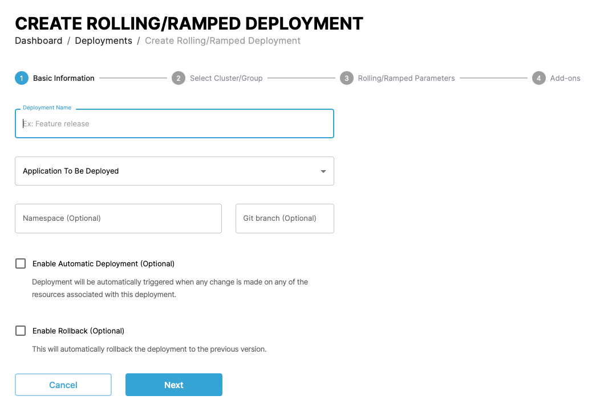
In the next step, select the cluster or cluster group to deploy the application to.
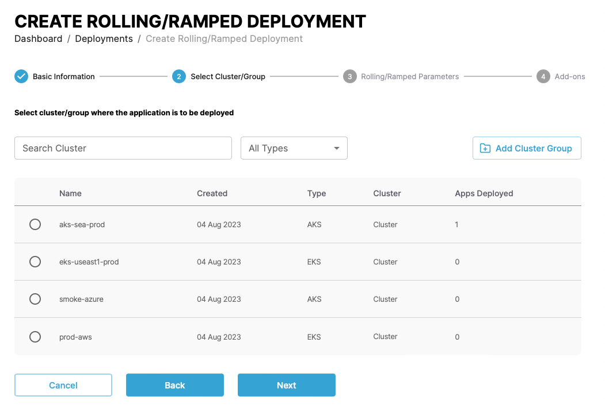

The next step shows the configuration for the deployment strategy. The values in your Kubernetes manifest file define the values you see here. Read more about `MaxSurge` and `MaxUnavailable` [in the Kubernetes documentation](https://kubernetes.io/docs/concepts/workloads/controllers/deployment/).

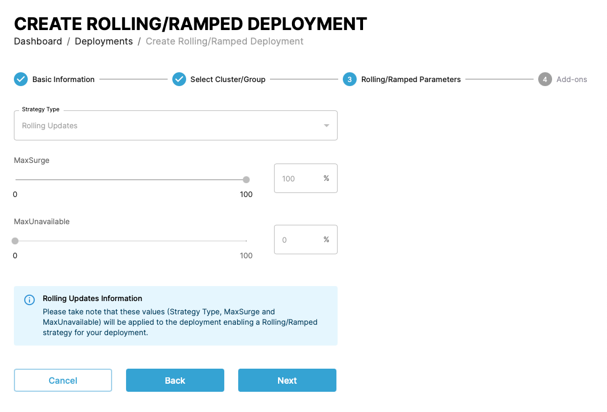
In the final step, select add-ons for the deployment. These can include:

- **Recommended actions**:
    - **Pre-flight tests**
    !!! Prerequisites
        **Pod level** services need to be install for preflight to work, e.g installed postgres/mysql/mariadb
    !!! info
        - Results returned from the pre-flight test are a direct output from Kubernetes
        - **Nginx version** by default is NA as nginx is at the global level and not at the pod level; thus, version is not returned by Kubernetes
    - Executing a **dry run** of the application deployment.
    - **Scan for latest changes** in manifests that define the application.
- **Deployment arguments**: Pass arguments to the deployment through placeholder variables in the application definition.
- **Estimate time & size**: Estimate the time and size of the application deployment.
- **Post deployement actions**: SSH and Webhook options to configure for post deployment actions. 

