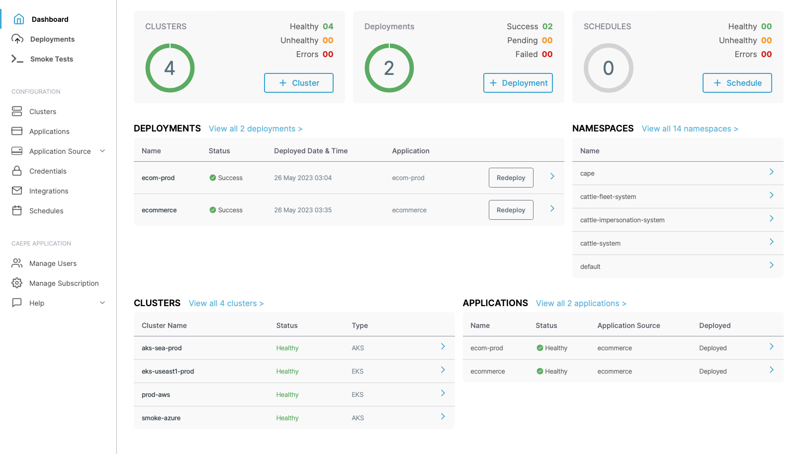
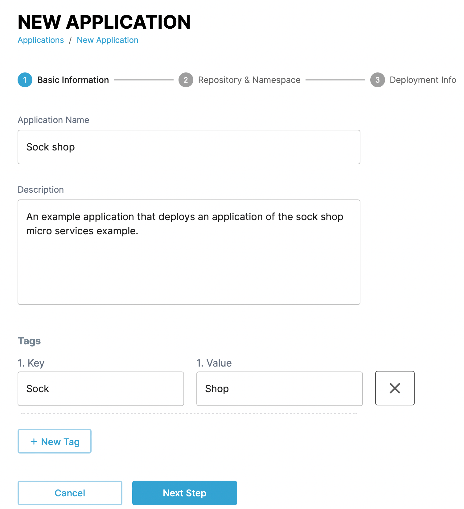
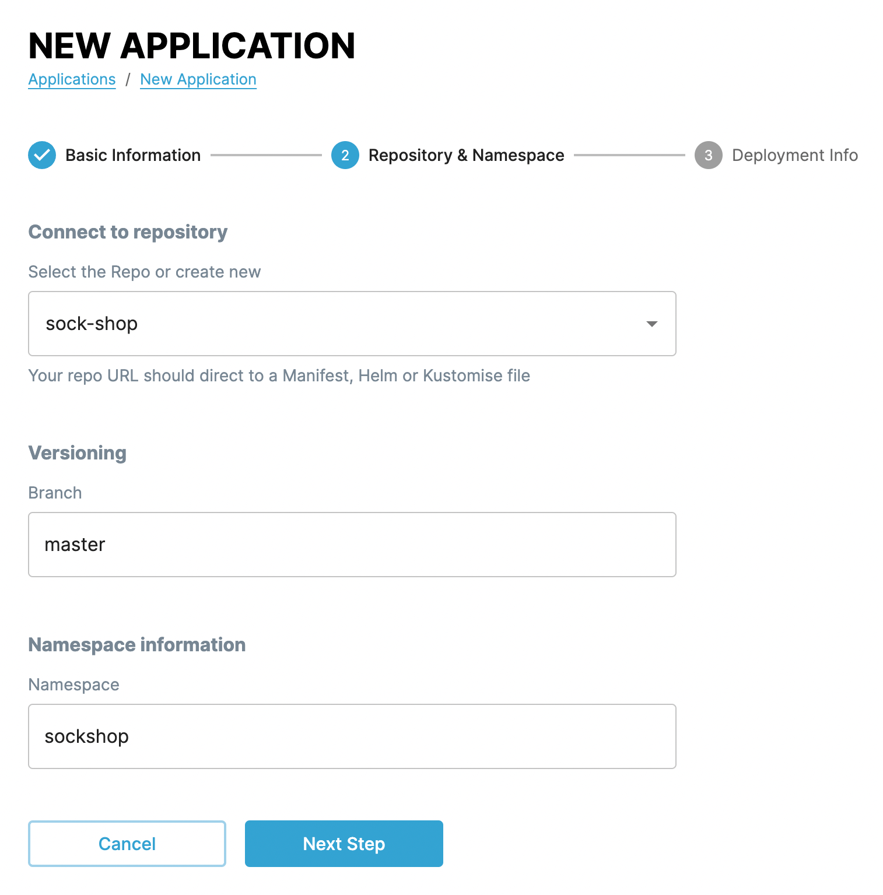
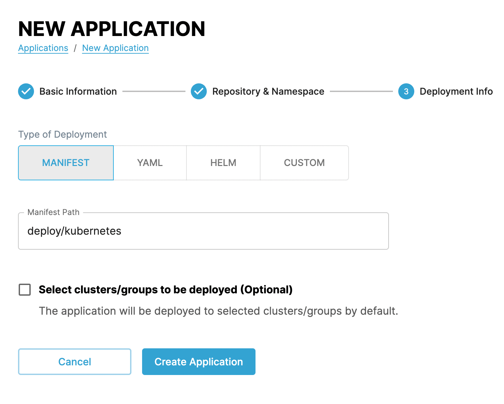
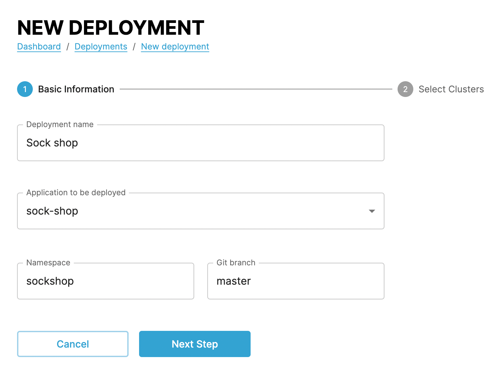

# CAEPE quickstart

This guide shows you how to access and log in to your CAEPE account portal and create the resources needed to run an application.

!!! tip

    This guide assumes you have received an email invitation from an account administrator and that you have an already running and accessible Kubernetes cluster.

This quickstart guide uses [the Sock shop microservices demo](https://github.com/microservices-demo/microservices-demo){:target="_blank"} as an application to deploy as you follow the steps in this guide.

You can follow the steps in the following demo video or follow the the instructions in the following sections to jump start your CAEPE journey.

<iframe width="854" height="480" src="https://www.youtube.com/embed/PYIe8MM2FC0?si=hFbIme1B1D5p1BgA" title="YouTube video player" frameborder="0" allow="accelerometer; autoplay; clipboard-write; encrypted-media; gyroscope; picture-in-picture; web-share" allowfullscreen></iframe>

## CAEPE account portal

The portal shows an overview of your account data and CAEPE application instances.

<!--  You can run the CAEPE application as a hosted instance, or self-host it on your own public cloud or on-premise infrastructure.

!!! tip

    This guide uses the hosted option, for more details on self-hosting CAEPE, [read the self-hosting section](self_host.md). -->

Find your pre-installed hosted instance from the _CAEPE Application_ menu item and clicking the _Launch CAEPE Application_ button.

After clicking the button, the CAEPE application dashboard appears. You can log in to the dashboard using the same credentials used to log in to the portal.

The application dashboard provides an overview of cluster and application resources and their health.

## Connect a cluster

Connect a cluster from the _Configuration_ -> _Clusters_ menu item and clicking the _New Cluster_ button. CAEPE supports connecting to an existing cluster, or building a new cluster as you connect to it. This quickstart connects to an existing cluster you should already have running.

Select the _Connect to live clusters_ button.

In the form that appears set a name and description for the cluster and a region. Set the type based on where the cluster is running. CAEPE supports clusters running on multiple Kubernetes providers, including:

- Amazon EKS
- Azure AKS
- Google GKE
- Lightweight Kubernetes (K3s)
- Kubernetes running on private clusters and on-premises
- OCI container engine
- Rancher Kubernetes engine

Upload a kubeconfig file for the cluster so that CAEPE has the connection details.

When you create a cluster you can add it to a logical grouping of clusters. You can select a pre-existing group, or create a new one.

!!! info

    [Find out more about clusters and cluster groups](../configuration/clusters.md).

When the Pods are ready, the cluster shows in the list with a "Healthy" state.

!!! info

    If you add the cluster to a pre-existing group that has an application defined for it, CAEPE automatically deploys that application to the new cluster.

## Create a repository

Repositories represent where CAEPE can find the definition of an application.

Create a repository from the _Configuration_ -> _Application Sources_ -> _Repositories_ menu item and clicking the _New Repository_ button.

You can select any public or private git-based repositories or Helm charts by supplying a name and a URL. If you need credentials to access repositories or Helm charts, select or create them with a user ID and password or private key.

When you create a repository, select the type and the location. CAEPE supports application definitions stored in the following repository types:

- Git
- Helm

And stored in the following locations:

- GitHub
- Bitbucket
- Gitlab
- Custom location

Give the repository a name and a URL.

!!! tip

    For the Sock shop application, use the following details:

    - Select _Git_ and _GitHub_
    - **Repository Name**: sock-shop
    - **Repository Url**: https://github.com/microservices-demo/microservices-demo

    Leave all other options.

!!! info

    [Find our more about repositories](../configuration/application_source.md).

## Create an application

Applications represent a Kubernetes application connected to a repository that you deploy to a cluster or cluster group multiple times.

Create an application from the _Configuration_ -> _Applications_ menu item and clicking the _New Application_ button.

First give the application a name, a description, and tags for metadata.

In the next step, select the repository created above, add the branch to use, and the namespace to create the application in.

!!! tip

    For the Sock shop application, use the following details:

    - **Branch**: master
    - **Namespace**: sock-shop

In the final step, select the path in the repository that contains the Kubernetes manifests that define the application. This folder is relative to the repository root.

CAEPE supports three deployment methods: Helm, Kustomize, and Manifest files. Select the one relevant for your application.

!!! tip

    For the Sock shop application, use the following details:

    - **Type of Deployment**: Manifest
    - **Path**: _deploy/kubernetes_

## Create a deployment

A deployment connects an Application to a Cluster to create running versions of applications at a particular time.

Create a deployment from the _Deployments_ menu item and clicking the _New Deployment_ button.

First give the deployment a name, select an application to deploy, the namespace to deploy the application to, and git branch or tag to pull the application definitions from.

In the next step, select the cluster or cluster group to deploy the application to.

!!! info

    [Find out more about deployments](../deployments.md).

### Confirm deployment

If you now use `kubectl get namespaces` you can see the CAEPE created namespace for the deployment, and if you list pods in the namespace with `kubectl get pods -n {NAMESPACE}` you can see the CAEPE created pods for the deployment.

<!-- TODO: Access application? -->
