Welcome to the CAEPE Test Drive

The CAEPE Test Drive gives you a hands-on way to explore CAEPE in a fully provisioned sandbox. No setup required—just jump in and try the latest build of the platform.

Below you’ll find everything you need to get started, plus a couple of recommended scenarios. These mirror common developer workflows and will give you a clear sense of how CAEPE simplifies deployments and day-to-day operations.

What’s Next After the Test Drive?

If the Test Drive clicks with you, take the next step with our free 2–6 week pilot. You’ll get unlimited clusters and full support from our team. Reach out at letschat@caepe.sh to learn more.

**Progressive Delivery (A/B Deployment)**

Progressive delivery strategies improve user experiences and minimize downtime.With CAEPE, guided UI workflows are provided for seamless deployment, precise routing control, and efficient version tagging.

**Smoke Testing**

Engineering teams routinely test deployments for scalability, reliability, or to assess applications on updated Kubernetes versions. CAEPE simplifies smoketesting, enabling deployment, testing, and management ofrollbacks or further deployments based on results.

## CAEPE Test Drive

After you complete the Test Drive form and click **Submit**, you will receive an email once your test drive is ready.

Keep this email handy. It contains essential information for a smooth experience. You'll need all the provided URLs later in this guide.

!!! info

    The unique infix numbers generated between "testdrive-xxxxx-chc" are specific to this specific test drive instance and will remain accessible for approximately 4 hours.Yoursession is entirely unique, and all data is automatically deleted at the end of your test drive session.

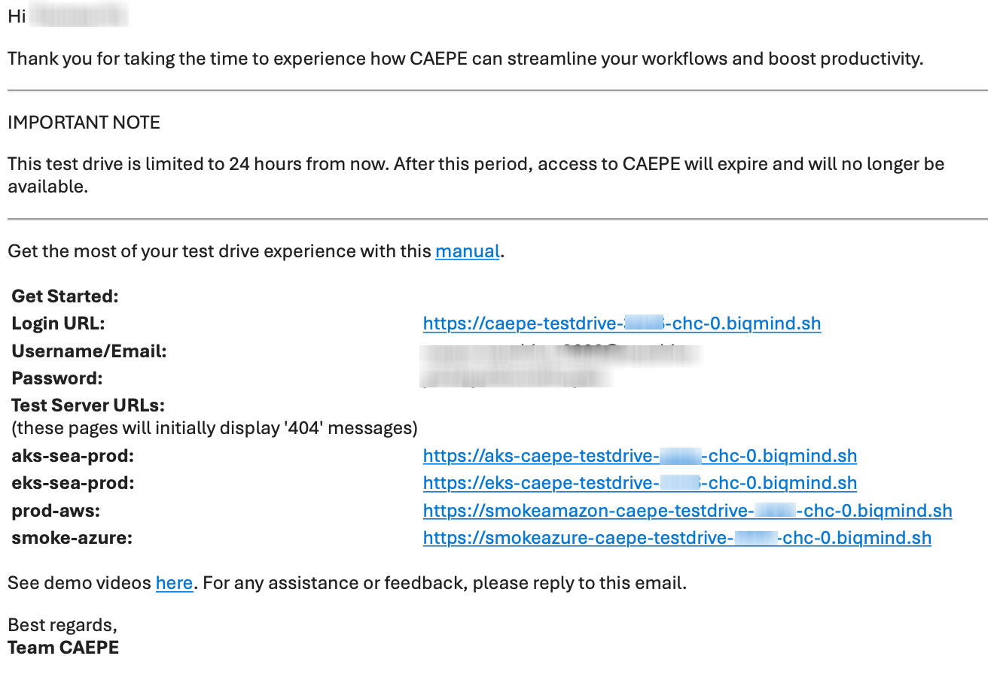

Proceed to login with the Login URL and credentials provided.

### A/B Deployment Walkthrough

An A/B strategy involves simultaneously deploying two versions of an application to different groups of users.

In this walkthrough, an ecommerce website will be deployed to the following clusters with different images:

- aks-sea-prod-caepe-testdrive-xxxx-caz-0=> a blue cat
- eks-useast1-prod-caepe-testdrive-xxxx-caz-0=> a redcat

Before you begin,click the EKS, and AKS URLs respectively in the email to check the deployments.

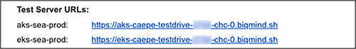

Both URLs should display blank pages.

**Implementation Steps**

1. Create an A/B deployment by clicking the **Create A/B Deployment** button from **the Deployments > Deployment Strategies** menu.

2. Fill in the fields as follows:
    - Strategy Name: ab-deploy-test
    - Description: ab-deploy-test

3.  From the **Application To Be Deployed** dropdown list, select **webshop**

    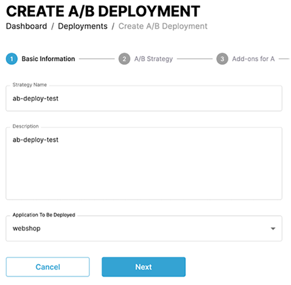

4.  Click **Next**

5.  On the **A/B strategy** page, select the **Deploy On To Different Clusters** option,

    - In the Cluster/Group for A field select **eks-useast1-prod-caepe-testdrive-xxxx-c****hc****-0** and enter **absplit** for Application Branch for A (Optional) field

    - In the Cluster/Group for B field, select **aks-sea-prod-caepe-testdrive-xxxx-c****hc****-0**

    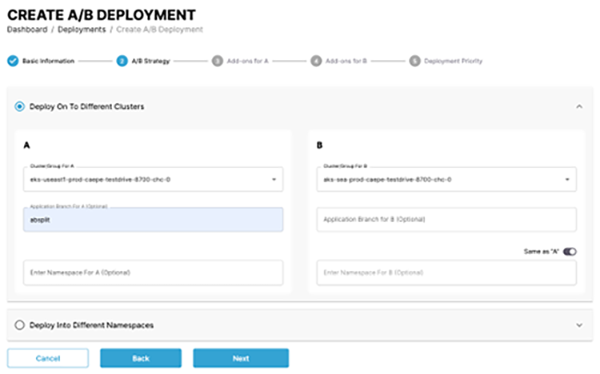

6. Click **Next**.

7. Click **Next** **Add-ons for A** page and **Add-ons for B** pages.

    !!! info

        See [Add-ons](../deployments.md) for more information

8. In the final step, on the deployment priority page, click **Create Deployment**.

9. A pop-up message will be displayed. Click on **Back to Deployments**.

    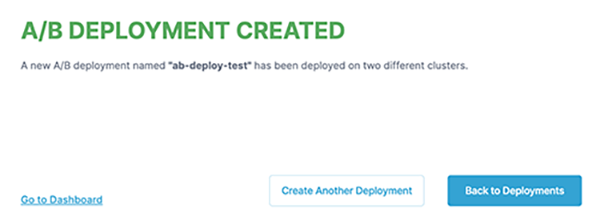

10. On the Deployments page, you will see two A/B deployments:

    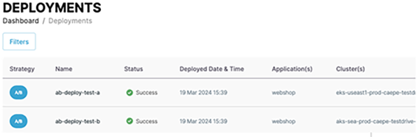

11. Refresh the EKS, and AKS URLs to check the deployments.

    !!! info

        See [Add-ons](../deployments.md) for more information 

The webshop application is now deployed to two separate clusters, each identified by a different color cat

<b>Version 2 ‘Blue Cat’ (AKS)</b>

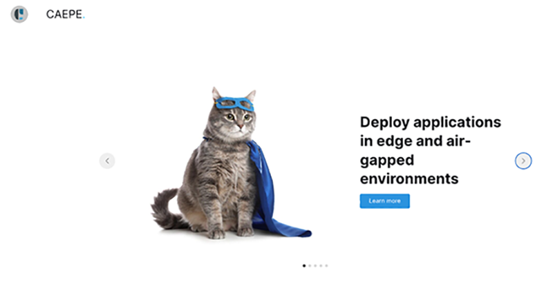

 
<b>Version 1 ‘Red Cat’ (EKS)</b>

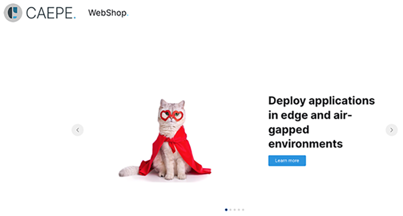

### Manage Deployments

In the center of the page, you will find the deployments linked to your account. You have the option to toggle between a "list" and "grid" view of these deployments. By clicking on the **Filters** button,you can further filter by deployment name, status, and strategy type.

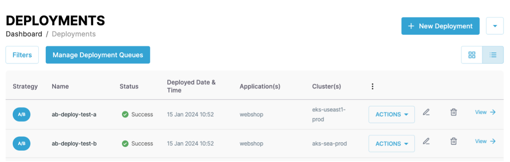

Each entry in the list or grid displays the deployment strategy name, status, deployment date & time, deployed application, cluster where the application is deployed, and an **Actions** button

### Smoke Test Deployment

With CAEPE, you can quickly deploy a snapshot of a production application or the latest version to an upgraded or new cluster type. This ensures compatibility through smoke, performance, penetration, or chaos tests.

Implementation Steps:

1. Create a Standard Deployment by clicking the **Create Deployment** button from the **Deployments > Deployment Strategies** menu.

2. Complete the fields as shown below:

    - Deployment Name: webshop-prod
    - Description: webshop-prod

3. From the **Application To Be Deployed** dropdown list, select **webshop****-prod,** and click **Next Step.**

    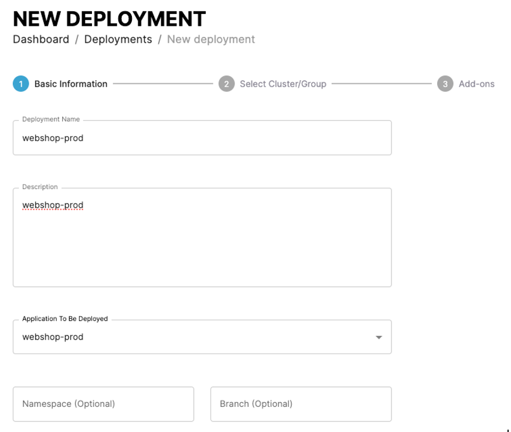

4. On the **Select Cluster/Group** page,select the **prod-aws-caepe-testdrive-xxxxx-c****hc****-0.**

5. Click **Next Step**.

6. On the **Add-ons** page, click **Create Deployment**.

    !!! info

        See [Add-ons](../deployments.md) for more information

7. In the final step, on the deployment priority page, click **Create Deployment**.This deployment will be used for smoke testing.

    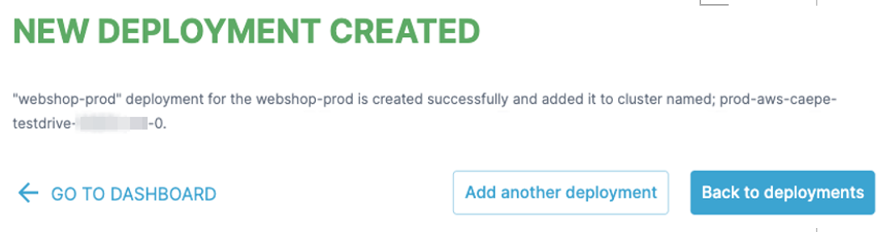

8. Click **Smoke Tests > + Define Snapshot button.**

9. Select the **prod-aws-caepe-testdrive-xxxx-c****hc****-0** from the **Snapshot Source Cluster** dropdown list.

    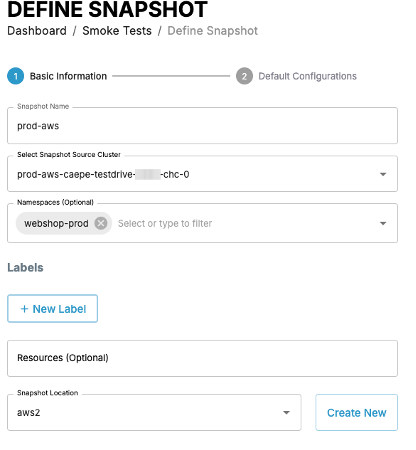

10. Fill in the fields as follows:

    - Snapshot name: *prod-**aws*
    - namespace: *webshop**-prod*
    - Resources: leave empty
    - Snapshot location: *aws2*

11. Click **Next**.

    !!! info

        Takes a few minutes for installation to complete. The Default Configurations page will be displayed.

    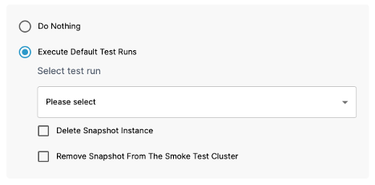

    !!! info

        Click on **Execute Default Test Runs** for more options. You can execute test runs such as pen/security testing etc., but we will not be using for this testdrive.

12. Click **Do Nothing**

    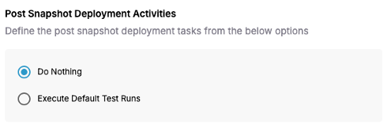

13. Click **Define Snapshot Now**

    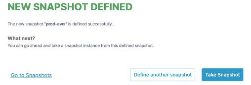

14. Click **Go to Snapshots**

15. Click the dropdown arrow on the **Actions** button of the prod-aws Snapshot Definition and click on **Snapshot & Deploy** from the menu display.

    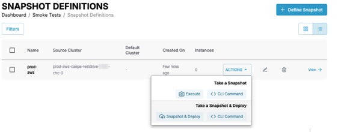

16. In the pop-up, select the smoke test cluster from the dropdown list.

    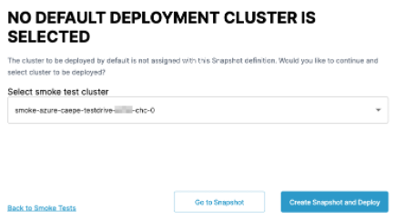

17. Click **Create Snapshot and Deploy**.

    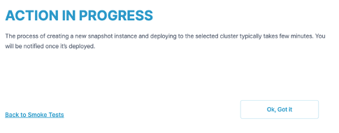

18. Click **Back to Smoke Tests** to return to the Smoke Test Dashboard.Takes about 2-4 minutesto deploy.

     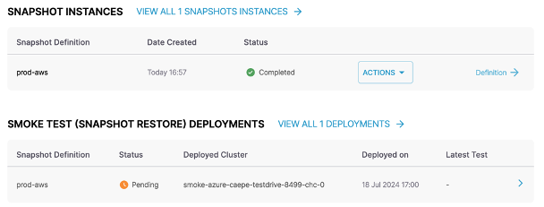

!!! Tip

    Refresh the browser(multiple times) after approximately 2-4 minutes to view the snapshot instance as it initiates, progresses, and completes, followed by the snapshot deployment running and reaching completion.

## Technical Support and Additional Resources

**Tech Support**: For any technical questions during your Test Drive, click on the ‘Need Help’ chat widget in the bottom right corner of the app to launch a support request

**Free Pilot**: Interested in evaluating CAEPE for your team? Take advantage of our complimentary 2 to 6-week pilot program, fully supported by our team. Email us at letschat@caepe.sh for more information.

**Other Resources**: Explore more [resources on CAEPE](https://caepe.sh/resources/)

