# Smoke tests

You can follow the steps in the following demo video or follow the the instructions in the following sections to use the various CAEPE features.

<iframe width="854" height="480" src="https://www.youtube.com/embed/o-3YZxe3vdU?si=ilCoLPeLi_Cx_sIX" title="YouTube video player" frameborder="0" allow="accelerometer; autoplay; clipboard-write; encrypted-media; gyroscope; picture-in-picture; web-share" allowfullscreen></iframe>

This guide shows you how to manage smoke tests and snapshots from the CAEPE account portal. You can access the section from the _Smoke Tests_ menu item.

!!! info

    **Smoke testing** is the preliminary check of software, after a build and before a release.

## Smoke tests dashboard

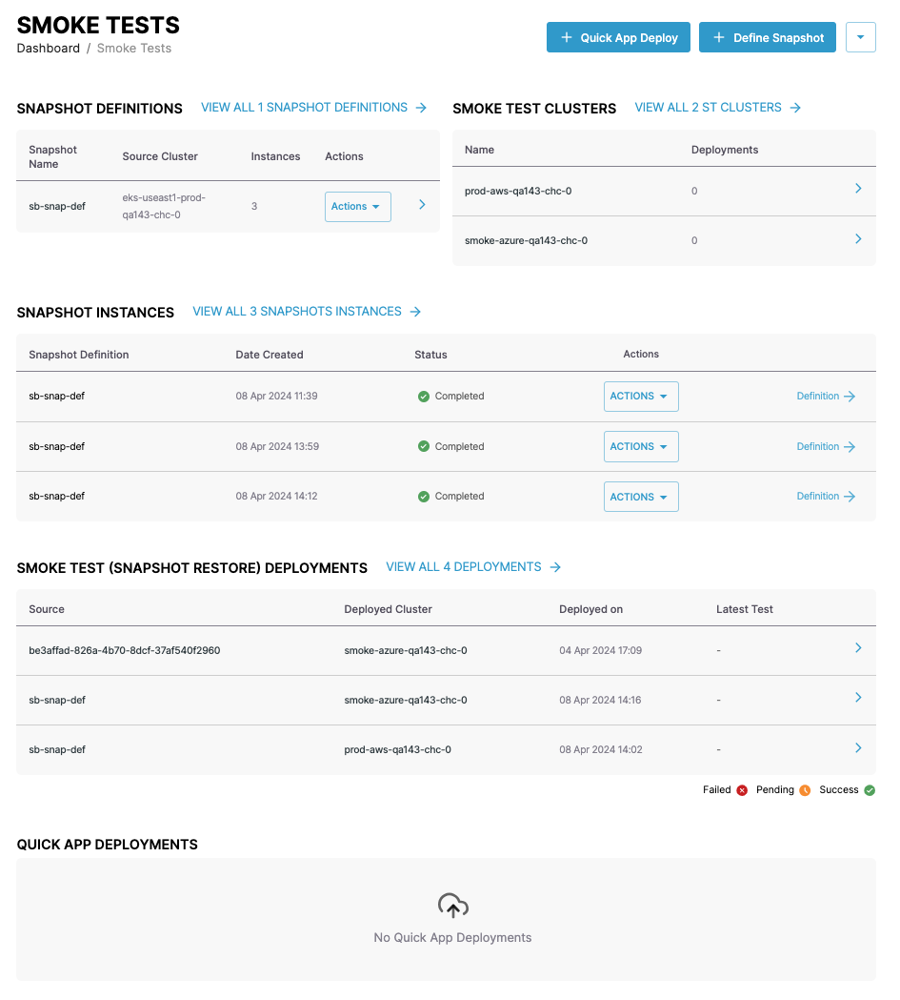

The smoke tests dashboard has four sections.

- [Snapshot definitions](#snapshot-definitions)
- [Snapshot instances](#snapshot-instances)
- [Smoke test deployments](#smoke-test-deployments)
- [Smoke test clusters](#smoke-test-clusters)

## Quick app deploy

To create a quick deployment of an application to a smoke test cluster, click the _+ Quick App Deploy_ button.

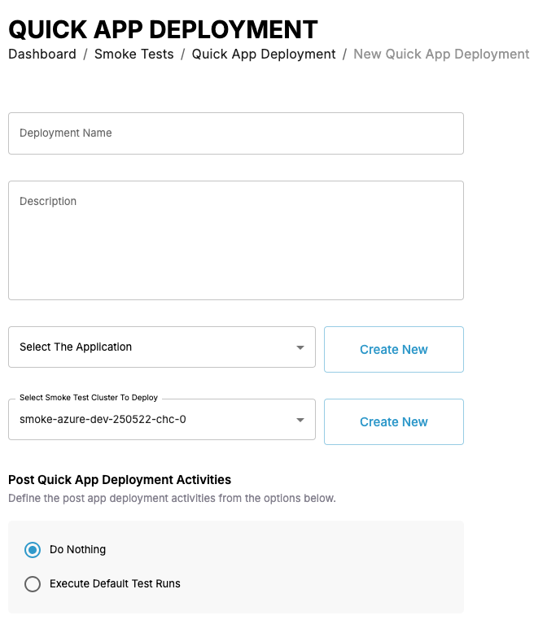

Give the deployment a name, select the application, and smoke test cluster to deploy to.

You can also define whether to run default tests after the deployment.

## Define a snapshot

!!! info

    **Snapshots** are a representation of a cluster at a point in time.

To define a snapshot, click the _+ Define Snapshot_ button.

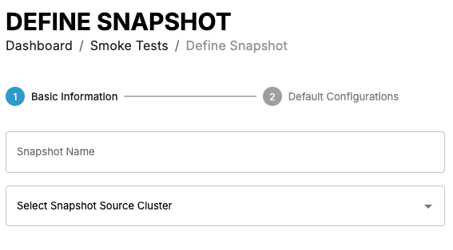

Give the snapshot definition a name, select the cluster to take the snapshot from, filter any namespaces and resources to include in the snapshot, and set a location for the snapshot.

Click the _Next_ button.

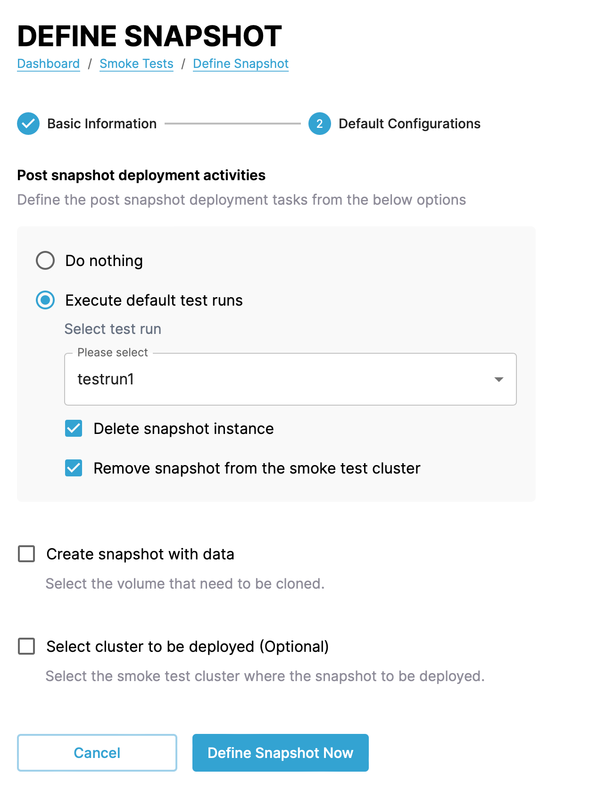

In the next step set the final options for the snapshot which include:

- Whether to run tests after CAEPE creates the snapshot. If you opt to run tests there are further options:

  - Which tests to run.
  - Whether to delete the snapshot or remove it from the smoke test cluster after the test run.

- Whether to include application data in the snapshot. If you select this option, pick which volumes to include.
- Whether to also create the snapshot on a smoke test cluster. If you select this option, pick which cluster to use.

Click the _Define Snapshot Now_ button. CAEPE then asks if you would like to create another definition or take a snapshot immediately.

## Snapshot locations

You can find snapshot locations from the dropdown and _Snapshot Locations_ menu next to the _+ Quick App Deploy_ and _+ Define Snapshot_ buttons.

This page shows all snapshot locations.
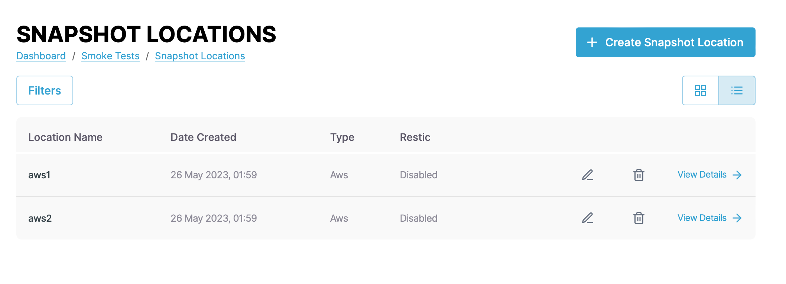

You can switch the view of the locations between a "list" and "grid" view and filter the instances by clicking the _Filters_ button. You can filter by name, status, and type.

Each entry in the list or grid shows the name, date created, type, and restic. Click the _pencil_ icon to edit the location and the _wastebasket_ icon delete to delete it.

### Snapshot location details

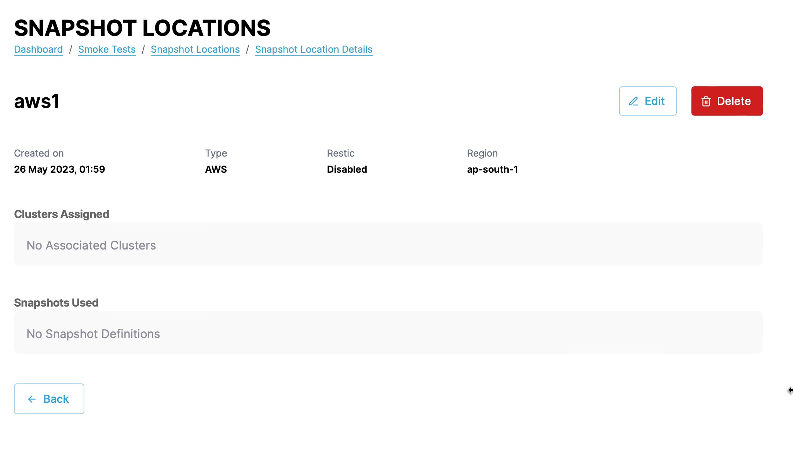

Click the _View Details_ link next to any snapshot location to see more details about the location including the created date, type, restic, region, clusters that use the location, and which snapshots use it. You can also edit and delete the location from the details page.

### Create a snapshot location

Create a snapshot location by clicking the _+ Create Snapshot Location_ button.

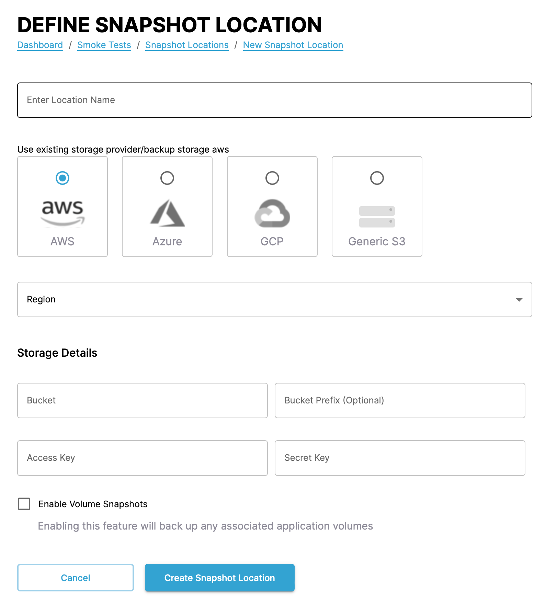

In the form that appears, set a name, provider, and region. The rest of the form then changes depending on the provider you select.

- AWS:
    - Bucket
    - Bucket prefix
    - Access key
    - Secret key
- Azure:
    - Bucket
    - Bucket prefix
    - Client ID
    - Client secret
    - Resource group
    - Storage account
    - Subscription
    - Tenant
- GCP:
    - Bucket
    - Bucket prefix
    - Project
    - Service account
- Generic S3:
    - Bucket
    - Bucket prefix
    - Access key
    - Secret key
    - Fully qualified domain name
    - Hostname

Finally, you can also define volume snapshots, to back up associated application data alongside configuration.

## Test runs

!!! info

    **Test runs** define a script to run against an application definition. They can trigger a script or a webhook.

You can find test runs from the dropdown and _Snapshot Locations_ menu next to the _+ Quick App Deploy_ and _+ Define Snapshot_ buttons.

This page shows all defined test runs.
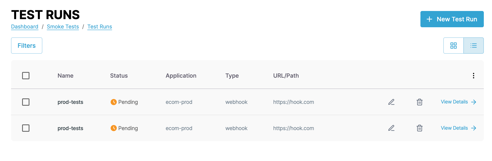

You can switch the view of the test runs between a "list" and "grid" view and filter the test runs by clicking the _Filters_ button. You can filter by name, status, and type.

Each entry in the list or grid shows the name, status, application, type, and URL or path to the test script.

### Create a test run

Create a test run by clicking the _+ New Test Run_ button.

In the form that appears, set a name and application. The rest of the form then changes depending on the option you select.

#### Webhook

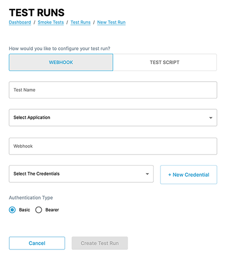

For a webhook test run, set the following:

- URL of the webhook
- Credentials for accessing the URL
- Authentication type for the URL

#### Test script

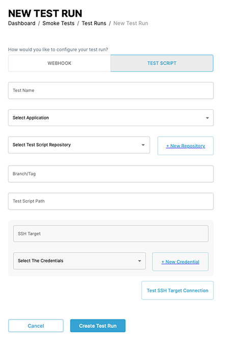

For a script test run, set the following:

- Repository for the test script
- The branch or tag in the repository for the test script
- The path to the test script
- The SSH credentials to run the script

### Snapshot definitions

!!! info

    A **Snapshot** captures the state of a cluster at a point in time.

This section shows the most recent snapshot definitions. Click the _view all_ link to see all snapshot definitions.

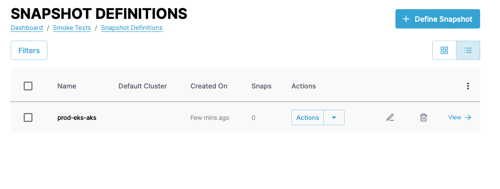

You can switch the view of the definitions between a "list" and "grid" view and filter the definitions by clicking the _Filters_ button. You can filter by definition name, status, and type.

Each entry in the list or grid shows the default cluster, the amount of snapshots, and the creation date.

Click the _pencil_ icon to edit the definition and the _wastebasket_ icon to delete it.

Click the _View_ link to [view more details of the definition](#snapshot-definition-details).

### Smoke test clusters

This section shows the top three clusters with smoke tests deployed to them in alphabetical order. Click the _view all_ link to see [all clusters](./configuration/clusters.md).

 

### Snapshot instances

This section shows the most recent snapshot instances. Click the _view all_ link to see all instances.

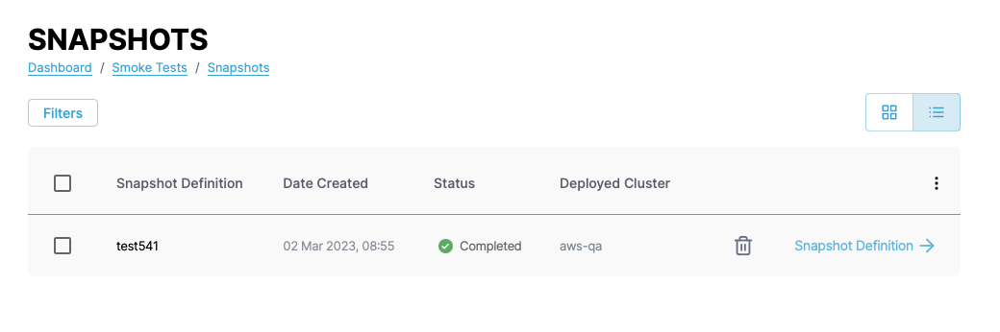

You can switch the view of the instances between a "list" and "grid" view and filter the instances by clicking the _Filters_ button. You can filter by cluster name.

Each entry in the list or grid shows the name, status, and the deployed cluster or an option to deploy to a cluster.

Click the _wastebasket_ icon delete to delete it.

Click the _Snapshot Definition_ link to [view more details of the definition](#snapshot-definition-details).

### Snapshot definition details

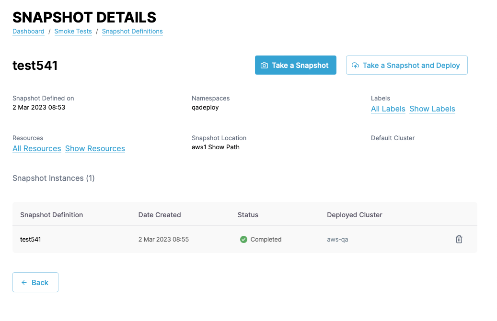

The snapshot definition details shows details of the snapshot definition including the creation date, the namespaces and labels the definition is based on, the resources within the definition, the save location of the definition, and the instances based on the definition.

Click the _wastebasket_ icon to delete any of the instances based on the definition.

You can also take a snapshot based on the definition and optionally deploy that snapshot from the details page.

### Smoke test deployments

This section shows the most recent smoke test deployments. Click the _view all_ link to see all smoke test deployments.

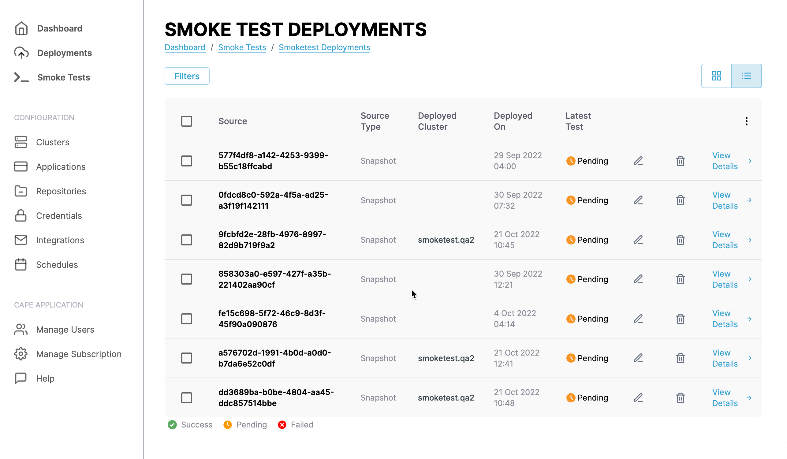

You can switch the view of the deployments between a "list" and "grid" view and filter the deployments by clicking the _Filters_ button. You can filter by cluster name.

Each entry in the list or grid shows the source and source type of the deployment, the cluster deployed to and when it was deployed, and the status of the test.

Click the _pencil_ icon to edit the definition and the _wastebasket_ icon to delete it.

#### Snapshot deployment details

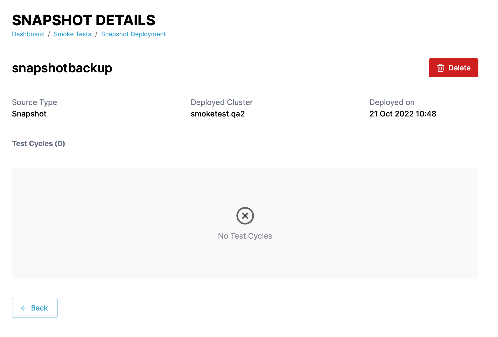

Click the _View Details_ link next to any deployment to see more details about the deployment including the source, the cluster deployed to and when, and the test cycles.
